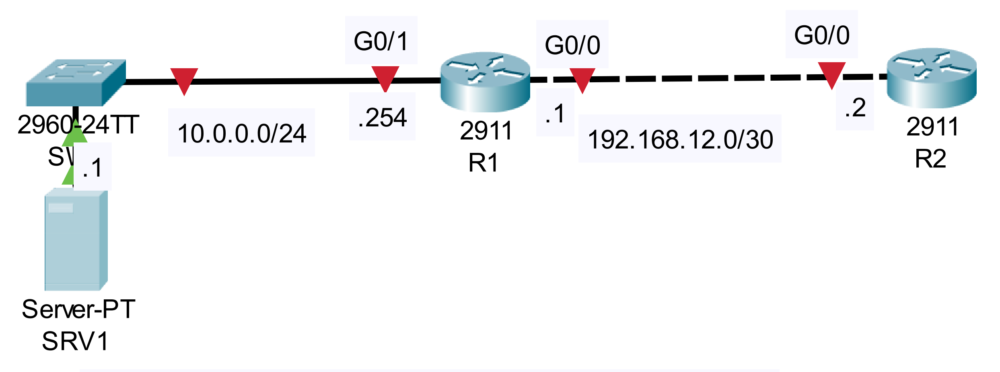

### The topology


|  |
|-|

1. Configure the appropriate IP addresses on each device. Configure routing on the routers to allow full connectivity.

**R2**

```CLI
R2>en
R2#conf t
R2(config)#interface g0/0
R2(config-if)#ip address 192.168.12.2 255.255.255.252
R2(config-if)#no shutdown
```

**R1**

```CLI
R1>en
R1#conf t
R1(config)#interface g0/0
R1(config-if)#ip address 192.168.12.1 255.255.255.252
R1(config-if)#no shutdown

R1(config-if)#interface g0/1
R1(config-if)#ip address 10.0.0.254 255.255.255.0
R1(config-if)#no shutdown
```

**Static Route on R2**

```CLI
R2(config)#ip route 10.0.0.0 255.255.255.0 192.168.12.1
```

2. Use TFTP on R1 to retrieve the following file from SRV1: c2900-universalk9-mz.SPA.155-3.M4a.bin

```CLI
R1#copy tftp: flash

Address or name of remote host []? 10.0.0.1
Source filename []? c2900-universalk9-mz.SPA.155-3.M4a.bin
Destination filename [c2900-universalk9-mz.SPA.155-3.M4a.bin]? 

Accessing tftp://10.0.0.1/c2900-universalk9-mz.SPA.155-3.M4a.bin....
Loading c2900-universalk9-mz.SPA.155-3.M4a.bin from 10.0.0.1: !!!!!!!!!!!!!!!!!!!!!!!!!!!!!!!!!!!!!!!!!!!!!!!!!!!!!!!!!!!!!!!!!!!!!!!!!!!!!!!!!!!!!!!!!!!!!!!!!!!!!!!!!!!!!!!!!!!!!!!!!!!!!!!!!!!!!!!!!!!!!!!!!!!!!!!!!!!!!!!!!!!!!!!!!!!!!!!!!!!!!!!!!!!!!!!!!!!!!!!!!!!!!!!!!!!!!!!!!!!!!!!!!!!!!!!!!!!!!!!!!!!!!!!!!!!!!!!!!!!!!!!!!!!!!!!!!!!!!!!!!!!!!!!!!!!!!!!!!!!!!!!!!!!!!!!!!!!!!!!!!!!!!!!!!!!!!!!!!!!!!!!!!!!!!!!!!!!!!!!!!!!!!!!!!!!!!!!!!!!!!!!!!!!!!!!!!!!!!!!!!!!!!!!!!!!!!!!!!!!!!!!!!!!!!!!!!!!!!!!!!!!!!!!!!!!!!!!!!!!!!!!!!!!!!!!!!!!!!!!!!!!!!!!!!!!!!!!!!!!!!!!!!!!!!!!!!!!!!!!!!!!!!!!!!!!!!!!!!!!!!!!!!!!!!!!!!!!!!!!!!!!!!!!!!!!!!!!!!!!!!!!!!!!!!!!!!!!!!!!!!!!!!!!!!!!!!!!!!!!!!!!!!!!!!!!!!!!!!!!!!!!!!!!!!!!!!!!!!
[OK - 33591768 bytes]

33591768 bytes copied in 7.901 secs (446398 bytes/sec)
```

3. Upgrade R1's OS and then delete the old file from flash.

```CLI
R1#show flash

System flash directory:
File  Length   Name/status
  3   33591768 c2900-universalk9-mz.SPA.151-4.M4.bin
  4   33591768 c2900-universalk9-mz.SPA.155-3.M4a.bin
  2   28282    sigdef-category.xml
  1   227537   sigdef-default.xml
[67439355 bytes used, 188304645 available, 255744000 total]
249856K bytes of processor board System flash (Read/Write)

R1#show version
Cisco IOS Software, C2900 Software (C2900-UNIVERSALK9-M), Version 15.1(4)M4, RELEASE SOFTWARE (fc2)
Technical Support: http://www.cisco.com/techsupport
Copyright (c) 1986-2012 by Cisco Systems, Inc.
Compiled Thurs 5-Jan-12 15:41 by pt_team

R1#conf t
R1(config)#boot system flash:c2900-universalk9-mz.SPA.155-3.M4a.bin
R1(config)#exit

R1#reload
 
System configuration has been modified. Save? [yes/no]:yes

Building configuration...
[OK]
Proceed with reload? [confirm]

R1#show version
Cisco IOS Software, C2900 Software (C2900-UNIVERSALK9-M), Version 15.5(3)M4a, RELEASE SOFTWARE (fc1)
Technical Support: http://www.cisco.com/techsupport
Copyright (c) 1986-2016 by Cisco Systems, Inc.
Compiled Thu 06-Oct-16 14:43 by mnguyen

R1#delete flash:c2900-universalk9-mz.SPA.151-4.M4.bin
Delete filename [c2900-universalk9-mz.SPA.151-4.M4.bin]?
Delete flash:/c2900-universalk9-mz.SPA.151-4.M4.bin? [confirm]

R1#show flash

System flash directory:
File  Length   Name/status
  5   33591768 c2900-universalk9-mz.SPA.155-3.M4a.bin
  2   28282    sigdef-category.xml
  1   227537   sigdef-default.xml
[33847587 bytes used, 221896413 available, 255744000 total]
249856K bytes of processor board System flash (Read/Write)
```

4. Use FTP on R2 to retrieve the following file from SRV1:
    - c2900-universalk9-mz.SPA.155-3.M4a.bin
    - (FTP username: jeremy, password: ccna)

```CLI
R2>en
R2#conf t
Enter configuration commands, one per line.  End with CNTL/Z.
R2(config)#ip ftp username jeremy
R2(config)#ip ftp password ccna
R2(config)#exit 

R2#copy ftp: flash
Address or name of remote host []? 10.0.0.1
Source filename []? c2900-universalk9-mz.SPA.155-3.M4a.bin
Destination filename [c2900-universalk9-mz.SPA.155-3.M4a.bin]? 

Accessing ftp://10.0.0.1/c2900-universalk9-mz.SPA.155-3.M4a.bin...
[OK - 33591768 bytes]

33591768 bytes copied in 309.363 secs (11400 bytes/sec)

R2#show flash

System flash directory:
File  Length   Name/status
  3   33591768 c2900-universalk9-mz.SPA.151-4.M4.bin
  4   33591768 c2900-universalk9-mz.SPA.155-3.M4a.bin
  2   28282    sigdef-category.xml
  1   227537   sigdef-default.xml
[67439355 bytes used, 188304645 available, 255744000 total]
249856K bytes of processor board System flash (Read/Write)
```

5. Upgrade R2's OS and then delete the old file from flash.
```CLI
R2#conf t
R2(config)#boot system flash:c2900-universalk9-mz.SPA.155-3.M4a.bin

R2(config)#do reload
System configuration has been modified. Save? [yes/no]:yes
Building configuration...
[OK]
Proceed with reload? [confirm]

R2#delete flash:c2900-universalk9-mz.SPA.151-4.M4.bin
Delete filename [c2900-universalk9-mz.SPA.151-4.M4.bin]?
Delete flash:/c2900-universalk9-mz.SPA.151-4.M4.bin? [confirm]
````