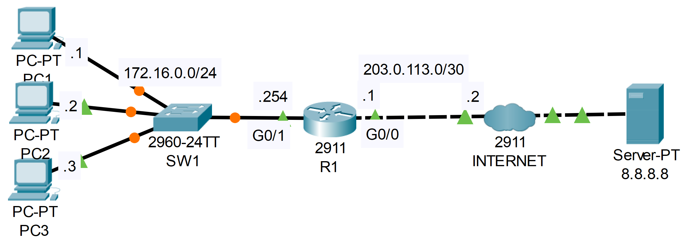

**Link to** [**Packet Tracer Solution File**](./Day%2044%20Lab%20-%20Static%20NAT.pkt)

### The topology


|  |
|-|

1. Attempt to ping from PC1 to 8.8.8.8.  Does the ping work?

```CLI
Cisco Packet Tracer PC Command Line 1.0
C:\>ping 8.8.8.8

Pinging 8.8.8.8 with 32 bytes of data:

Request timed out.
Request timed out.
Request timed out.
Request timed out.

Ping statistics for 8.8.8.8:
    Packets: Sent = 4, Received = 0, Lost = 4 (100% loss),
```

2. Configure static NAT on R1.
   > Configure the appropriate inside/outside interfaces
   > Map the IP addresses of PC1, PC2, and PC3 to 100.0.0.x/24

```CLI
R1>en
R1#conf t

R1(config)#interface g0/1
R1(config-if)#ip nat inside

R1(config-if)#interface g0/0
R1(config-if)#ip nat outside
R1(config-if)#exit

R1(config)#ip nat inside source static 172.16.0.1 100.0.0.1
R1(config)#ip nat inside source static 172.16.0.2 100.0.0.2
R1(config)#ip nat inside source static 172.16.0.3 100.0.0.3
```

3. Ping 8.8.8.8 from PC1 again.  Does the ping work?

```CLI
C:\>ping 8.8.8.8

Pinging 8.8.8.8 with 32 bytes of data:

Reply from 8.8.8.8: bytes=32 time<1ms TTL=126
Reply from 8.8.8.8: bytes=32 time<1ms TTL=126
Reply from 8.8.8.8: bytes=32 time<1ms TTL=126
Reply from 8.8.8.8: bytes=32 time<1ms TTL=126

Ping statistics for 8.8.8.8:
    Packets: Sent = 4, Received = 4, Lost = 0 (0% loss),
Approximate round trip times in milli-seconds:
    Minimum = 0ms, Maximum = 0ms, Average = 0ms
```

4. Ping google.com from each PC, and then check the NAT translations on R1.

```CLI
R1#show ip nat translations

Pro  Inside global     Inside local       Outside local      Outside global
icmp 100.0.0.1:13      172.16.0.1:13      172.217.175.238:13 172.217.175.238:13
icmp 100.0.0.1:14      172.16.0.1:14      172.217.175.238:14 172.217.175.238:14
icmp 100.0.0.1:15      172.16.0.1:15      172.217.175.238:15 172.217.175.238:15
icmp 100.0.0.1:16      172.16.0.1:16      172.217.175.238:16 172.217.175.238:16
icmp 100.0.0.2:1       172.16.0.2:1       172.217.175.238:1  172.217.175.238:1
icmp 100.0.0.2:2       172.16.0.2:2       172.217.175.238:2  172.217.175.238:2
icmp 100.0.0.2:3       172.16.0.2:3       172.217.175.238:3  172.217.175.238:3
icmp 100.0.0.2:4       172.16.0.2:4       172.217.175.238:4  172.217.175.238:4
icmp 100.0.0.3:1       172.16.0.3:1       172.217.175.238:1  172.217.175.238:1
icmp 100.0.0.3:2       172.16.0.3:2       172.217.175.238:2  172.217.175.238:2
icmp 100.0.0.3:3       172.16.0.3:3       172.217.175.238:3  172.217.175.238:3
icmp 100.0.0.3:4       172.16.0.3:4       172.217.175.238:4  172.217.175.238:4
---  100.0.0.1         172.16.0.1         ---                ---
---  100.0.0.2         172.16.0.2         ---                ---
---  100.0.0.3         172.16.0.3         ---                ---
udp 100.0.0.1:1025     172.16.0.1:1025    8.8.8.8:53         8.8.8.8:53
udp 100.0.0.2:1025     172.16.0.2:1025    8.8.8.8:53         8.8.8.8:53
udp 100.0.0.3:1025     172.16.0.3:1025    8.8.8.8:53         8.8.8.8:53

R1#show ip nat statistics

Total translations: 6 (3 static, 3 dynamic, 3 extended)
Outside Interfaces: GigabitEthernet0/0
Inside Interfaces: GigabitEthernet0/1
Hits: 19  Misses: 23
Expired translations: 16
Dynamic mappings:
R1#
```

5. Clear the NAT translations on R1.  Which entries remain?

```CLI
R1#clear ip nat translation *

R1#show ip nat translations

Pro  Inside global     Inside local       Outside local      Outside global
---  100.0.0.1         172.16.0.1         ---                ---
---  100.0.0.2         172.16.0.2         ---                ---
---  100.0.0.3         172.16.0.3         ---                ---

R1#show ip nat statistics

Total translations: 3 (3 static, 0 dynamic, 0 extended)
Outside Interfaces: GigabitEthernet0/0
Inside Interfaces: GigabitEthernet0/1
Hits: 19  Misses: 23
Expired translations: 16
Dynamic mappings:
```