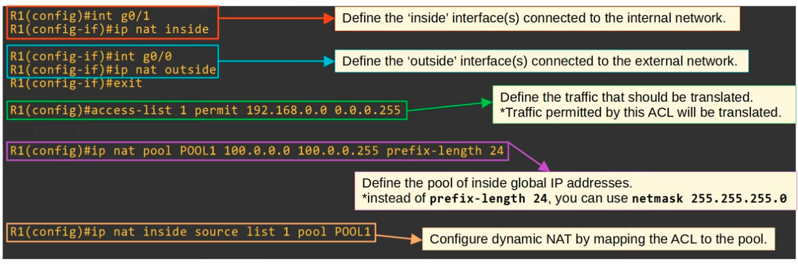
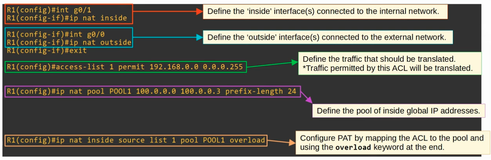
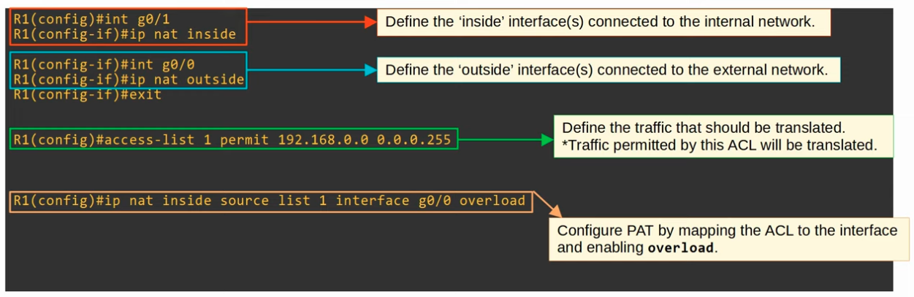
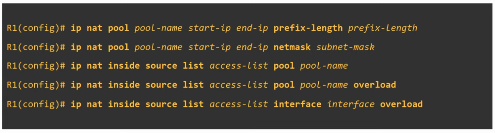

### Dynamic NAT Configuration

### PAT Configuration, with NAT Pool

**Alternative: Configuration to make the Router use the IP Address of its outbound interface**

**Overview of Configurations**

