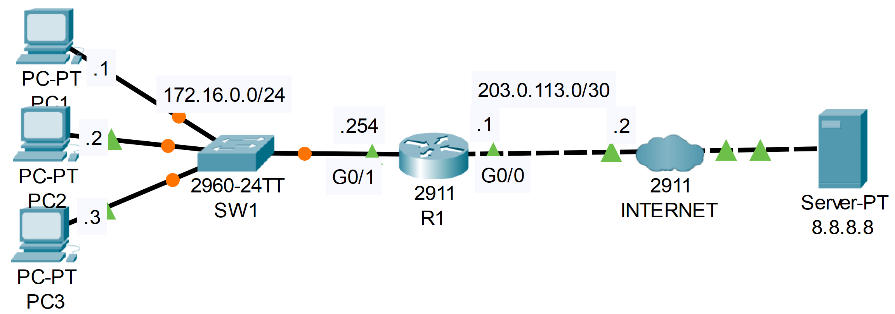

### The topology


|  |
|-|

1. Configure dynamic NAT on R1.
   > Configure the appropriate inside/outside interfaces
   > Translate all traffic from 172.16.0.0/24
   > Create a pool of 100.0.0.1 to 100.0.0.2 from the 100.0.0.0/24 subnet

```CLI
R1>en
R1#conf t

R1(config)#interface g0/1
R1(config-if)#ip nat inside

R1(config-if)#interface g0/0
R1(config-if)#ip nat outside
R1(config-if)#exit

R1(config)#access-list 1 permit 172.16.0.0 0.0.0.255

R1(config)#ip nat pool POOL1 100.0.0.1 100.0.0.2 netmask 255.255.255.0

R1(config)#ip nat inside source list 1 pool POOL1
```

2. Ping google.com from PC1 and PC2.  Then, ping it from PC3.  
    What happens to PC3's ping?

**PC3's Ping fails**

```CLI
Cisco Packet Tracer PC Command Line 1.0
C:\>ping google.com
Ping request could not find host google.com. Please check the name and try again.
```

```CLI
R1#show ip nat translations

Pro  Inside global     Inside local       Outside local      Outside global
icmp 100.0.0.1:1       172.16.0.1:1       172.217.175.238:1  172.217.175.238:1
icmp 100.0.0.1:2       172.16.0.1:2       172.217.175.238:2  172.217.175.238:2
icmp 100.0.0.1:3       172.16.0.1:3       172.217.175.238:3  172.217.175.238:3
icmp 100.0.0.1:4       172.16.0.1:4       172.217.175.238:4  172.217.175.238:4
icmp 100.0.0.2:1       172.16.0.2:1       172.217.175.238:1  172.217.175.238:1
icmp 100.0.0.2:2       172.16.0.2:2       172.217.175.238:2  172.217.175.238:2
icmp 100.0.0.2:3       172.16.0.2:3       172.217.175.238:3  172.217.175.238:3
icmp 100.0.0.2:4       172.16.0.2:4       172.217.175.238:4  172.217.175.238:4
udp 100.0.0.1:1025     172.16.0.1:1025    8.8.8.8:53         8.8.8.8:53
udp 100.0.0.2:1025     172.16.0.2:1025    8.8.8.8:53         8.8.8.8:53

!AFTER 1 MINUTE (ICMP RECORDS CLEARED, UDP RECORDS WILL BE CLEARED AFTER 5 MINUTES)
R1#show ip nat translations

Pro  Inside global     Inside local       Outside local      Outside global
udp 100.0.0.1:1025     172.16.0.1:1025    8.8.8.8:53         8.8.8.8:53
udp 100.0.0.2:1025     172.16.0.2:1025    8.8.8.8:53         8.8.8.8:53
```

3. Clear the NAT translations and remove the current NAT configuration.
    Switch the configuration to PAT using R1's public IP address.

```CLI
R1#clear ip nat translation *

R1#show ip nat translations
!EMPTY OUTPUT

R1#conf t
R1(config)#no ip nat inside source list 1 pool POOL1

!TO CONFIGURE PAT TO USE R1's OUTGOING G0/0 INTERFACE ADDRESS
R1(config)#ip nat inside source list 1 interface g0/0
```

4. Ping google.com from each PC.  Do the pings work?
    Examine the NAT translations on R1.

**YES! They are all able to ping simultaneously**

```CLI
R1#show ip nat translations
Pro  Inside global     Inside local       Outside local      Outside global
icmp 203.0.113.1:1024  172.16.0.2:5       172.217.175.238:5  172.217.175.238:1024
icmp 203.0.113.1:1025  172.16.0.2:6       172.217.175.238:6  172.217.175.238:1025
icmp 203.0.113.1:1026  172.16.0.2:7       172.217.175.238:7  172.217.175.238:1026
icmp 203.0.113.1:1027  172.16.0.2:8       172.217.175.238:8  172.217.175.238:1027
icmp 203.0.113.1:1     172.16.0.3:1       172.217.175.238:1  172.217.175.238:1
icmp 203.0.113.1:2     172.16.0.3:2       172.217.175.238:2  172.217.175.238:2
icmp 203.0.113.1:3     172.16.0.3:3       172.217.175.238:3  172.217.175.238:3
icmp 203.0.113.1:4     172.16.0.3:4       172.217.175.238:4  172.217.175.238:4
icmp 203.0.113.1:5     172.16.0.1:5       172.217.175.238:5  172.217.175.238:5
icmp 203.0.113.1:6     172.16.0.1:6       172.217.175.238:6  172.217.175.238:6
icmp 203.0.113.1:7     172.16.0.1:7       172.217.175.238:7  172.217.175.238:7
icmp 203.0.113.1:8     172.16.0.1:8       172.217.175.238:8  172.217.175.238:8
udp 203.0.113.1:1024   172.16.0.2:1026    8.8.8.8:53         8.8.8.8:53
udp 203.0.113.1:1026   172.16.0.1:1026    8.8.8.8:53         8.8.8.8:53
udp 203.0.113.1:1027   172.16.0.3:1027    8.8.8.8:53         8.8.8.8:53
```