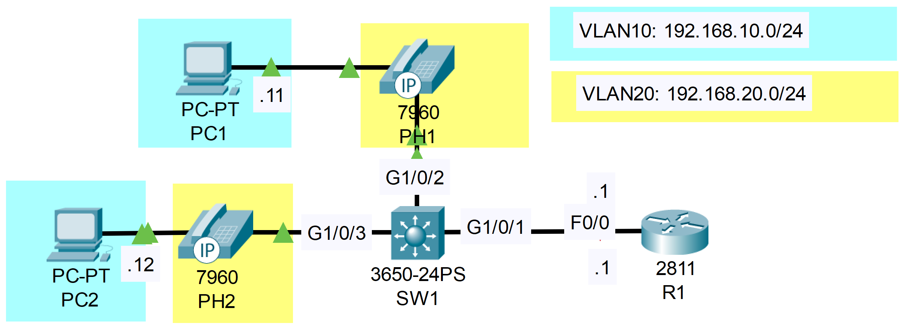

### The topology



**Telephony configurations (not relevant to the CCNA) have been pre-configured on R1**
1. Configure SW1's interfaces in the appropriate VLANs.

```CLI
SW1>en
SW1#conf t
SW1(config)#interface range g1/0/2 - 3

SW1(config-if-range)#switchport mode access

SW1(config-if-range)#switchport access vlan 10
% Access VLAN does not exist. Creating vlan 10

SW1(config-if-range)#switchport voice vlan 20
% Voice VLAN does not exist. Creating vlan 20
```

2. Configure ROAS for the connection between SW1 and R1.

**SW1**

```CLI
SW1>en
SW1#conf t

SW1(config)#interface g1/0/1
SW1(config-if)#switchport mode trunk	
SW1(config-if)#switchport trunk allowed vlan 10,20
```

**R1**

```CLI
R1>en
R1#conf t

R1(config)#interface f0/0.10
R1(config-subif)#encapsulation dot1q 10
R1(config-subif)#ip address 192.168.10.1 255.255.255.0
R1(config-subif)#no shutdown

R1(config-subif)#interface f0/0.20
R1(config-subif)#encapsulation dot1q 20
R1(config-subif)#ip address 192.168.20.1 255.255.255.0
R1(config-subif)#no shutdown
```

3. In simulation mode, ping PC2 from PC1.
    Is the traffic tagged with a VLAN ID?

*WATCH THE VIDEO TO LEARN HOW TO DO STEP 4*
4. In simulation mode, call PH1 from PH2.  Is the traffic tagged with a VLAN ID?