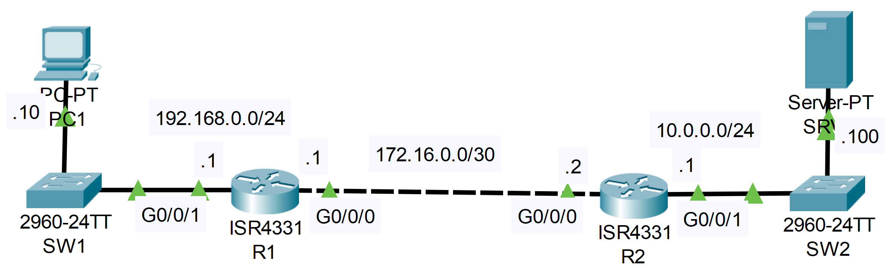

### The topology



Configure the following QoS settings on R1
and apply them outbound on interface G0/0/0:

```CLI
R1>en
R1#conf t

R1(config)#class-map HTTPS_MAP
R1(config-cmap)#match protocol https
R1(config-cmap)#exit

R1(config)#class-map HTTP_MAP
R1(config-cmap)#match protocol http
R1(config-cmap)#exit

R1(config)#class-map ICMP_MAP
R1(config-cmap)#match protocol icmp
R1(config-cmap)#exit
R1(config)#
```

1. Mark HTTPS traffic as AF31
*--Provide minimum 10% bandwidth as a priority queue

```CLI
R1(config)#policy-map G0/0/0_OUT

R1(config-pmap)#class HTTPS_MAP
R1(config-pmap-c)#set ip dscp AF31
R1(config-pmap-c)#priority percent 10
R1(config-pmap-c)#exit
```

2. Mark HTTP traffic as AF32
*--Provide minimum 10% bandwidth

```CLI
R1(config-pmap)#class HTTP_MAP
R1(config-pmap-c)#set ip dscp AF32
R1(config-pmap-c)#priority percent 10
R1(config-pmap-c)#exit
```

3. Mark ICMP traffic as CS2
*--Provide minimum 5% bandwidth

```CLI
R1(config-pmap)#class ICMP_MAP
R1(config-pmap-c)#set ip dscp cs2
R1(config-pmap-c)#bandwidth percent 5
```

**Check the running-configuration**

```CLI
R1(config)#do sh run | section policy-map
policy-map G0/0/0_OUT
 class HTTPS_MAP
  priority percent 10
  set ip dscp af31
 class HTTP_MAP
  priority percent 10
  set ip dscp af32
 class ICMP_MAP
  bandwidth percent 5
  set ip dscp cs2
```

**Finally, apply the police map to the interface**

```CLI
R1(config)#interface g0/0/0
R1(config-if)#service-policy output G0/0/0_OUT
```

4. Use simulation mode to view the DSCP markings of packets:
   -when pinging jeremysitlab.com from PC1
   -when accessing jeremysitlab.com from PC1 via HTTP
   -when accessing jeremysitlab.com from PC1 via HTTPS
 