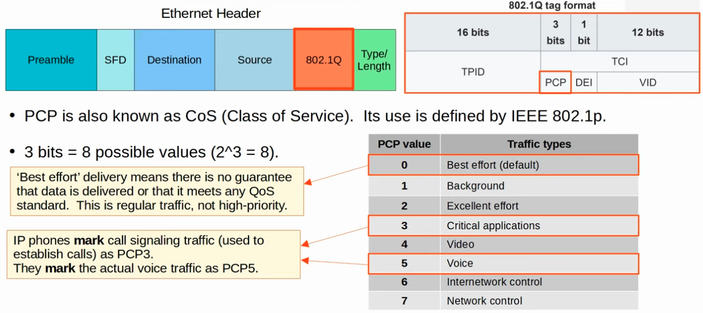
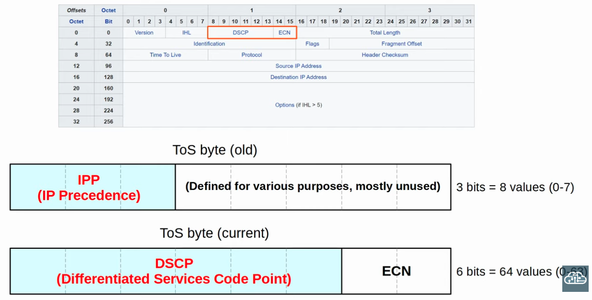
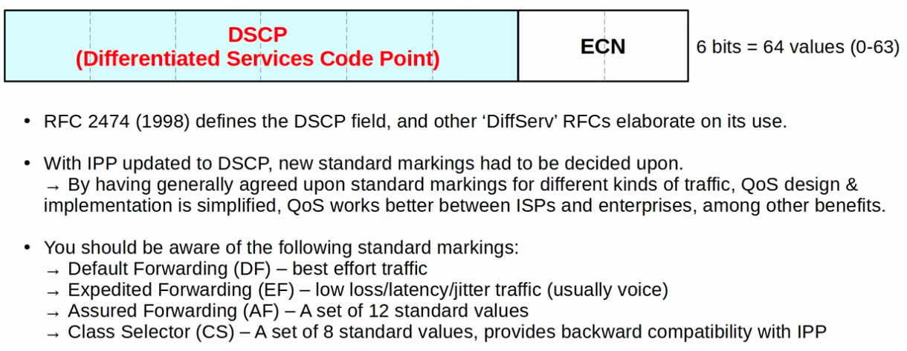
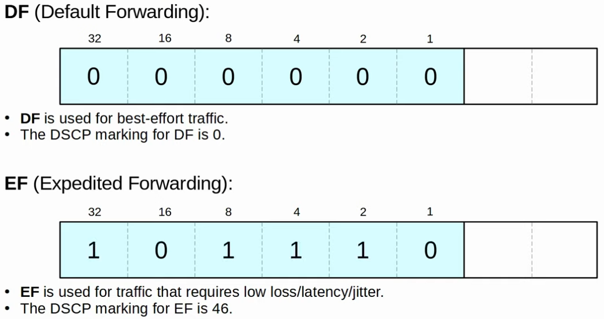
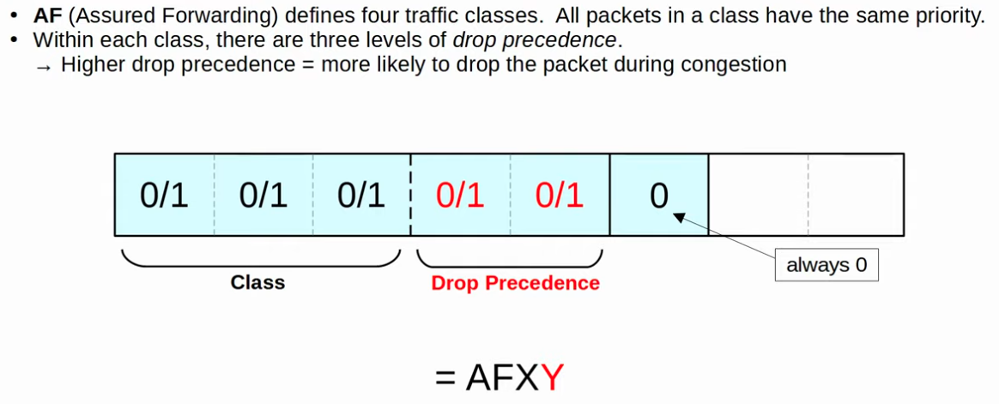
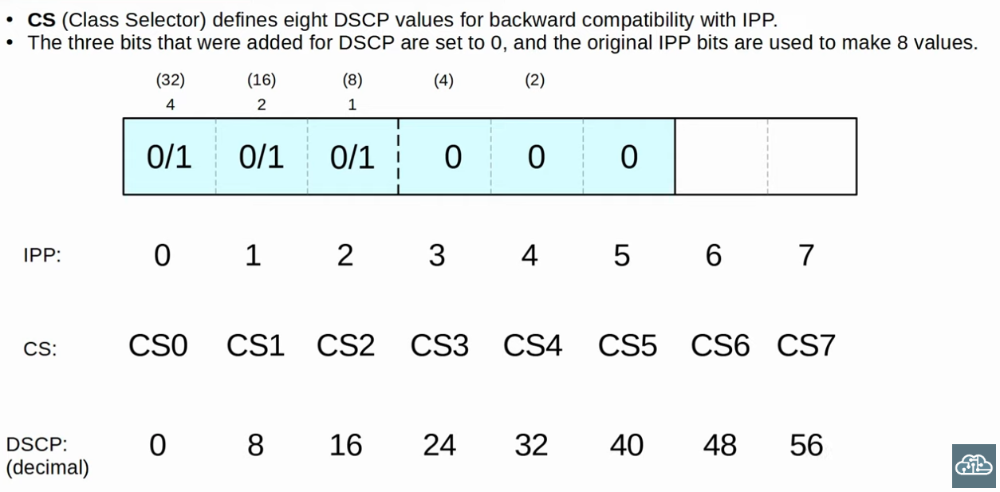
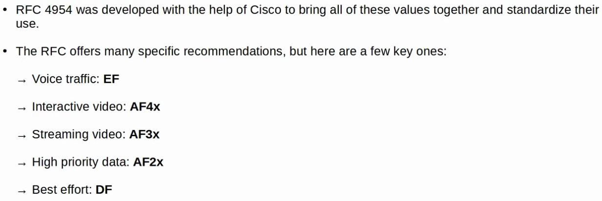
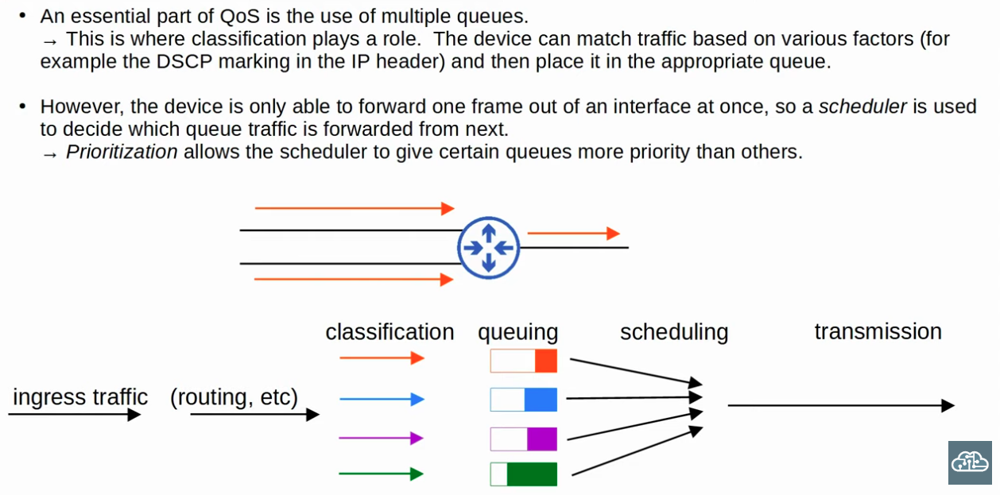
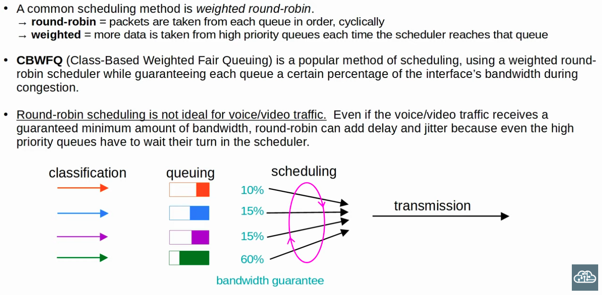
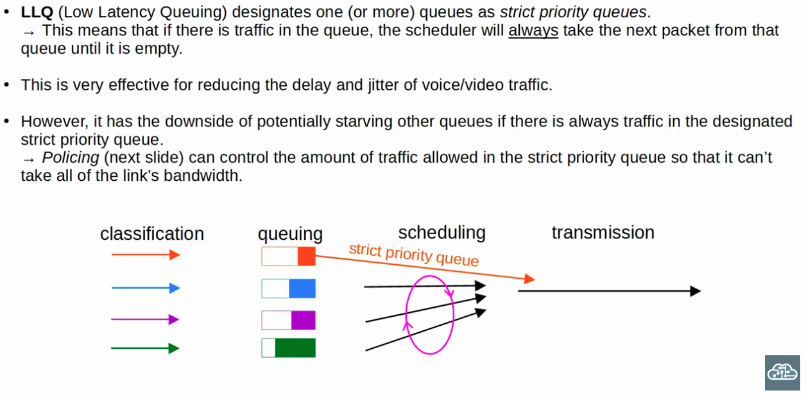

### The PCP (Class of Sevice) field of the 802.1Q Tag in the Ethernet (Layer 2) Header

### Layer 3 Traffic Classification (The IP ToS Byte: DSCP + ECN)

 

**RFC 4954**

---

### Queue/Congestion Management

---