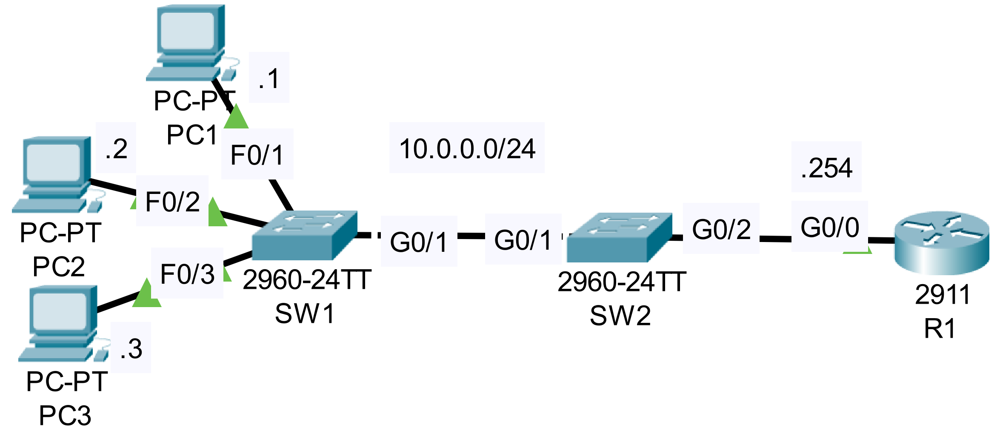

### The topology


|  |
|-|

1. Configure port security on the following interfaces:
    - **#SW1 F0/1, F0/2, F0/3#**
    - Violation mode: Shutdown
    - Maximum addresses: 1
    - Sticky learning: Disabled
    - Aging time: 1 hour

    ```CLI
    SW1>en
    SW1#conf t

    SW1(config)#interface range f0/1 - 3
    SW1(config-if-range)#switchport port-security 
    Command rejected: FastEthernet0/1 is a dynamic port.
    Command rejected: FastEthernet0/2 is a dynamic port.
    Command rejected: FastEthernet0/3 is a dynamic port.

    SW1(config-if-range)#switchport mode access
    SW1(config-if-range)#switchport port-security 
        
    SW1#show port-security
    Secure Port MaxSecureAddr CurrentAddr SecurityViolation Security Action
                (Count)       (Count)        (Count)
    --------------------------------------------------------------------
            Fa0/1        1          0                 0         Shutdown
            Fa0/2        1          0                 0         Shutdown
            Fa0/3        1          0                 0         Shutdown
    ----------------------------------------------------------------------

    SW1#show port-security interface f0/1
    Port Security              : Enabled
    Port Status                : Secure-up
    Violation Mode             : Shutdown
    Aging Time                 : 0 mins
    Aging Type                 : Absolute
    SecureStatic Address Aging : Disabled
    Maximum MAC Addresses      : 1
    Total MAC Addresses        : 0
    Configured MAC Addresses   : 0
    Sticky MAC Addresses       : 0
    Last Source Address:Vlan   : 0000.0000.0000:0
    Security Violation Count   : 0

    SW1#conf t
    SW1(config)#interface range f0/1 - 3
    SW1(config-if-range)#switchport port-security aging time 60
    SW1(config-if-range)#do show port-security interface f0/1
    Port Security              : Enabled
    Port Status                : Secure-up
    Violation Mode             : Shutdown
    Aging Time                 : 60 mins
    Aging Type                 : Absolute
    SecureStatic Address Aging : Disabled
    Maximum MAC Addresses      : 1
    Total MAC Addresses        : 0
    Configured MAC Addresses   : 0
    Sticky MAC Addresses       : 0
    Last Source Address:Vlan   : 0000.0000.0000:0
    Security Violation Count   : 0
    ```

    - **#SW2 G0/1#**
    - Violation mode: Restrict
    - Maximum addresses: 4
    - Sticky learning: Enabled

    ```CLI
    SW2>en
    SW2#conf t
    SW2(config)#interface g0/1
    SW2(config-if)#switchport port-security
    Command rejected: GigabitEthernet0/1 is a dynamic port.
    SW2(config-if)#switchport mode trunk

    SW2(config-if)#switchport port-security violation restrict

    SW2(config-if)#switchport port-security maximum 4

    SW2(config-if)#switchport port-security mac-address sticky

    SW2(config-if)#do show port-security interface g0/1
    Port Security              : Enabled
    Port Status                : Secure-up
    Violation Mode             : Restrict
    Aging Time                 : 0 mins
    Aging Type                 : Absolute
    SecureStatic Address Aging : Disabled
    Maximum MAC Addresses      : 4
    Total MAC Addresses        : 1
    Configured MAC Addresses   : 0
    Sticky MAC Addresses       : 0
    Last Source Address:Vlan   : 0060.471C.1D19:1
    Security Violation Count   : 0
    ```

2. Trigger port security violations on SW1 and SW2 (for example by 
    connecting another PC) and observe the actions taken by each switch.

- **We can test port-security on SW1 by first pinging between PC1 and R1 with the default settings. After the successful ping, manually change the MAC address on PC1 - the interface on SW1 will be err-disabled**

- **We can test the configured port security on SW2 by pinging R1 from an SVI on SW1, BUT ONLY AFTER SW2 ALREADY LEARNED THE MAC ADDRESS OF SW1's G0/1 INTERFACE (i.e. through an earlier ping process)**

```CLI
SW1(config)#interface Vlan 1
SW1(config-if)#ip address 10.0.0.10 255.255.255.0
SW1(config-if)#no shutdown

!PING R1 FROM THE CREATED INTERFACE
SW1(config-if)#do ping 10.0.0.254
```