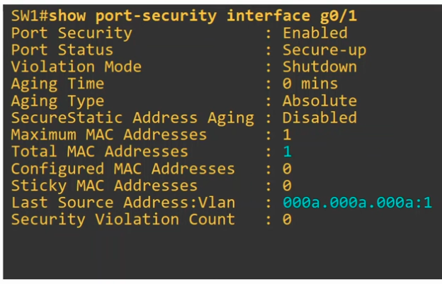
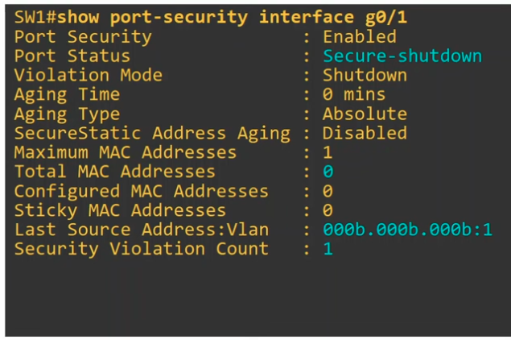
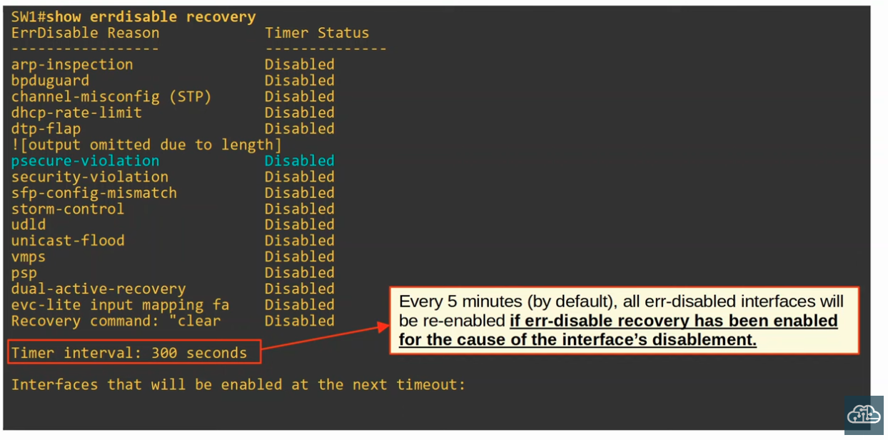
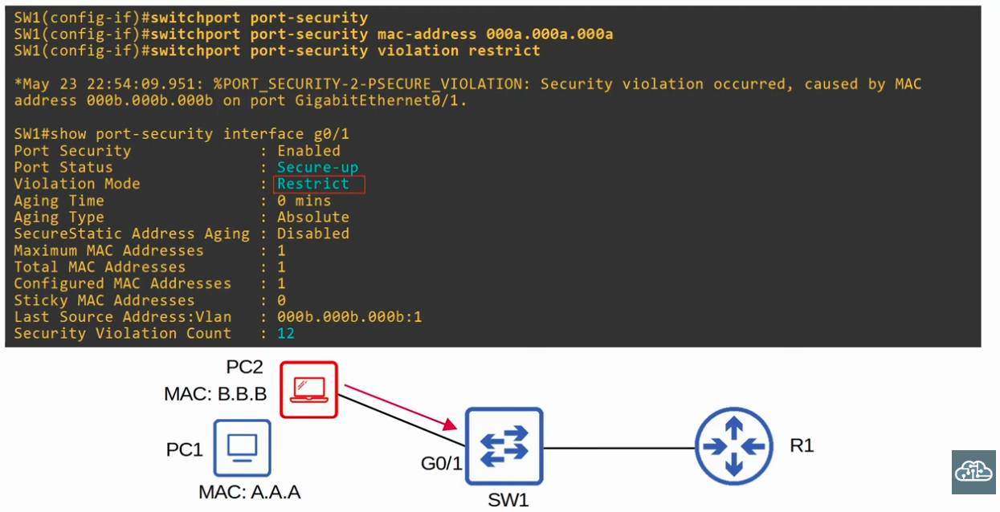
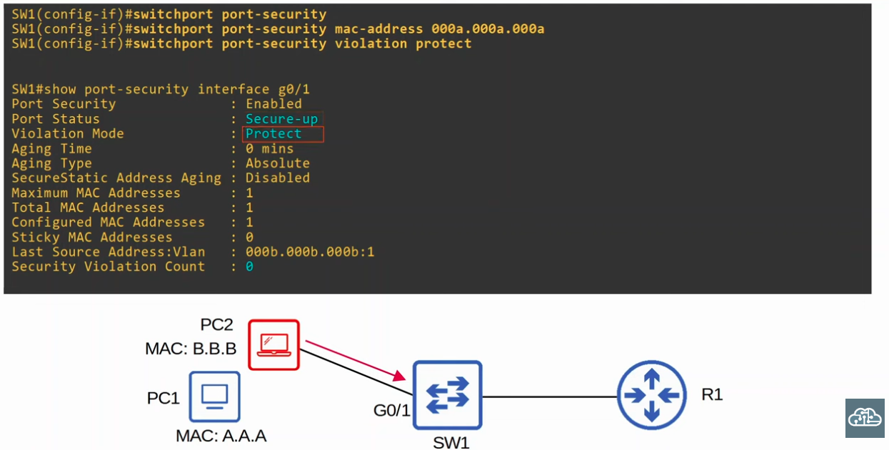
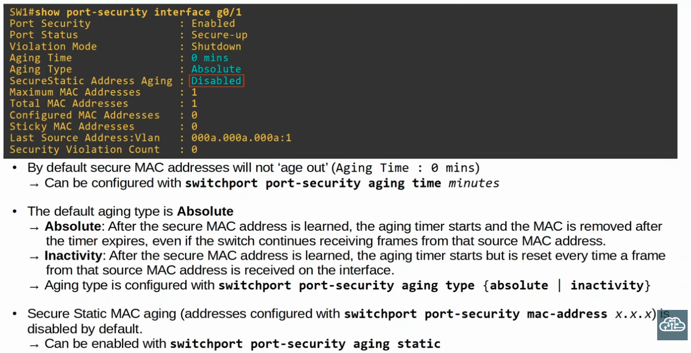
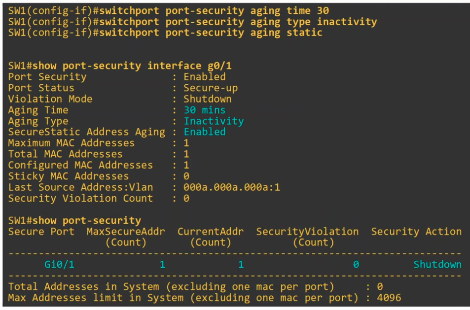

### Enabling Port Security


- **"Aging Time" of 0 mins means the addresses will not age out/there is no timer**

**After pinging R1 from PC1**



**After pinging R1 from PC2**



**Manually re-anabling an interface shutdown by err-disable**

- First, you must disconnect the unauthorized device
```CLI
Switch(config)#interface g0/1
Switch(config-if)#shutdown
Switch(config-if)#no shutdown
```

**Automatically Re-enabling an interface by configuring ErrDisable Recovery settings**

- Four our case, where the reason for err-disable was 'psecure-violation'



```CLI
Switch(config)#errdisable recovery cause psecure-violation

Switch(config)#errdisable recovery interval 180
```

- **Note:** ErrDisable Recovery is useless if you don't remove the device that caused the interface to enter the err-disabled state.

### Alternative 1 to Shudown Violation Mode: RESTRICT MODE



### Alternative 1 to Shudown Violation Mode: PROTECT MODE



### Secure MAC Address aging



