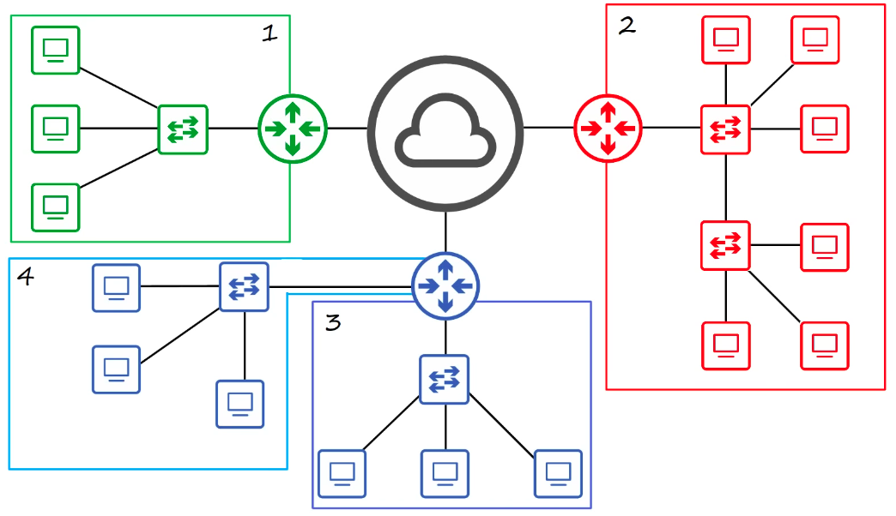
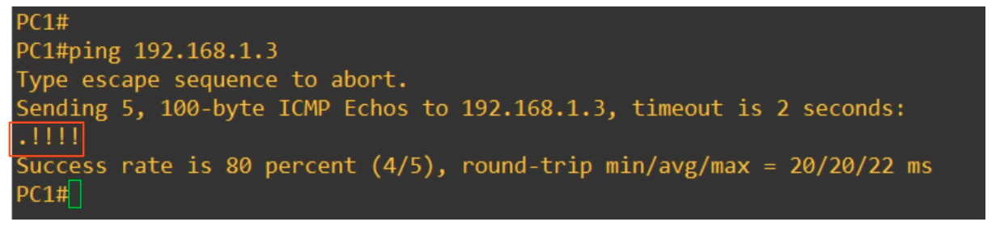

### Image illustrating how to single out distinct LANs in a complex web of networks

### Image showing details of Layer 2 Header & Trailer

### Diagram showing how switches build MAC Address Tables by forwarding frames through their interfaces (Dynamic MAC Address, Unknown Unicast Frames, Flooding, Interfaces)

### Image roughly illustrating an ARP Request Frame

### Image illustrating ARP in use for network Pings
