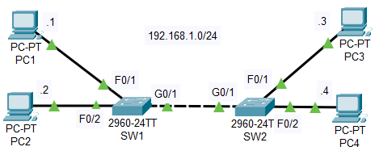
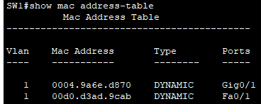
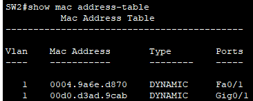
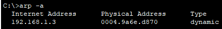
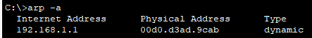
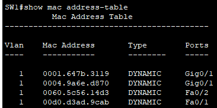
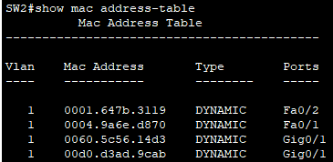
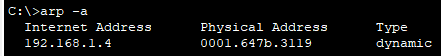
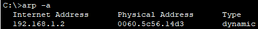

# The topology

### When PC1 pings PC3:
1. I assume that because an IPV4 address is involved, the ARP Protocol is invoked, therefore an ARP request is sent first, via broadcast.

2. SW1 & SW2 learn the MAC addresses of these two PCs involved in the exchange, using it to build their MAC address tables:

3. PC1's ARP table, on successful reply from PC3, builds its ARP table (command: arp -a) containing only the details of PC3:

4. PC3 has also learned the details of PC1 in this ping exchange, and uses it to build its ARP table:

### When PC2 pings PC4:
1. ARP Protocol invoked (IP Addresses involved)

2. SW1 & SW2 learn the MAC addresses of these two PCs involved in the exchange, using it to build their MAC address tables, after which the tables are complete:

3. PC2 and PC4 have learned of each others details, using this to create their own ARP tables:

