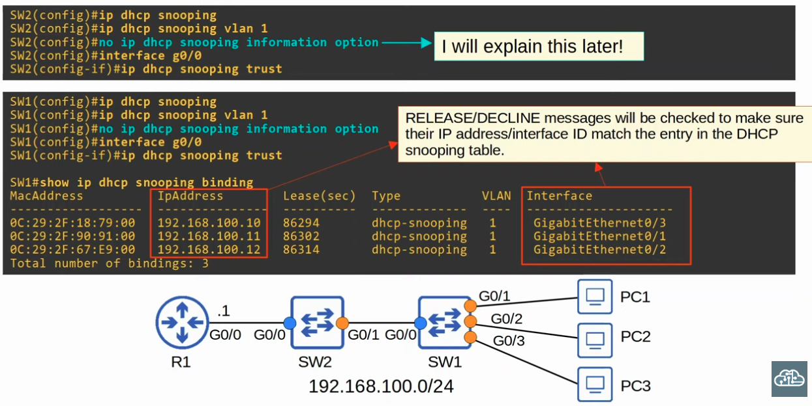
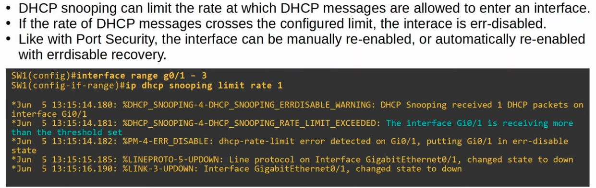
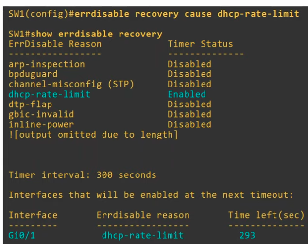
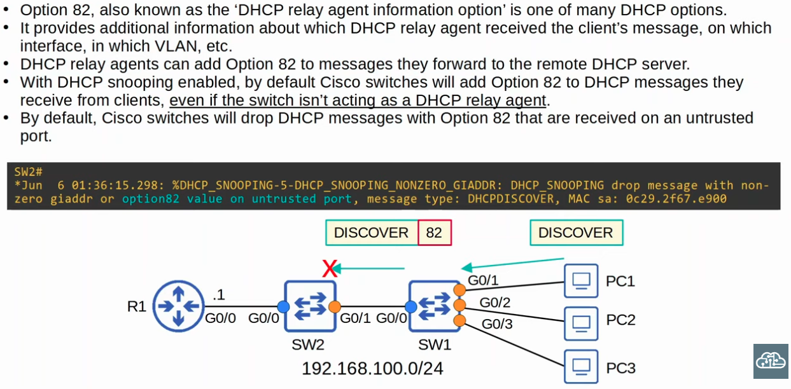
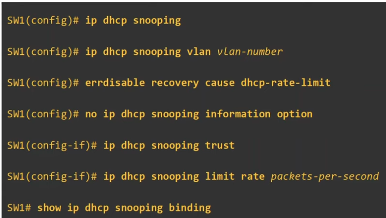

### DHCP Snooping Configuration on Swithes



### DHCP Snooping Rate-Limiting

- **The Configuration below shows rate-limiting set to 1 DHCP message per second, which is too low for even legitimate DHCP exchanges**



- **The configuration below shows how to configure errdisable recovery for dhcp-rate-limit violations**



### DHCP Option 82

- Option 82 should only be added to DHCP messages if the switch is a Layer 3 switch AND a relay agent, not if the switch is a regular ethernet switch



**Disabling Switches from adding Option 82 to DHCP messages**

```CLI
SW1(config)#no ip dhcp snooping information option

SW1(config)#no ip dhcp snooping information option
```

### DHCP Snooping command overview

