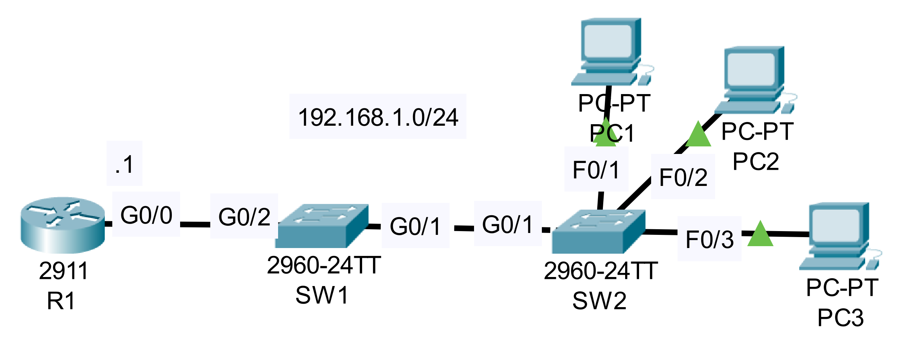

### The topology


|  |
|-|

1. Configure R1 as a DHCP server. Exclude 192.168.1.1 - 192.168.1.9 from the pool. Set Default gateway as R1.

```CLI
R1>en
R1#conf t
R1(config)#ip dhcp excluded-address 192.168.1.1 192.168.1.9
R1(config)#ip dhcp pool POOL1
R1(dhcp-config)#network 192.168.1.0 255.255.255.0
R1(dhcp-config)#default-router 192.168.1.1
```

2. Configure DHCP snooping on SW1 and SW2. Configure the uplink interfaces as trusted ports.

**SW1**

```CLI
SW1>en
SW1#conf t
SW1(config)#ip dhcp snooping
SW1(config)#ip dhcp snooping vlan 1

SW1(config)#interface g0/2
SW1(config-if)#ip dhcp snooping trust
```

**SW2**

```CLI
SW2>en
SW2#conf t
SW2(config)#ip dhcp snooping
SW2(config)#ip dhcp snooping vlan 1

SW2(config)#interface g0/1
SW2(config-if)#ip dhcp snooping trust
```

3. Use IPCONFIG /RENEW on PC1 to get an IP address.
    Does it work?  Why or why not?

```CLI
Cisco Packet Tracer PC Command Line 1.0
C:\>ipconfig /renew
DHCP request failed.
```

4. If it doesn't work, make the necessary configuration change to fix it.

```CLI
!SW1
SW1(config)#no ip dhcp snooping information option

!SW2
SW2(config)#no ip dhcp snooping information option
```

**PC1**

```CLI
C:\>ipconfig /renew

   IP Address......................: 192.168.1.10
   Subnet Mask.....................: 255.255.255.0
   Default Gateway.................: 192.168.1.1
   DNS Server......................: 0.0.0.0
```