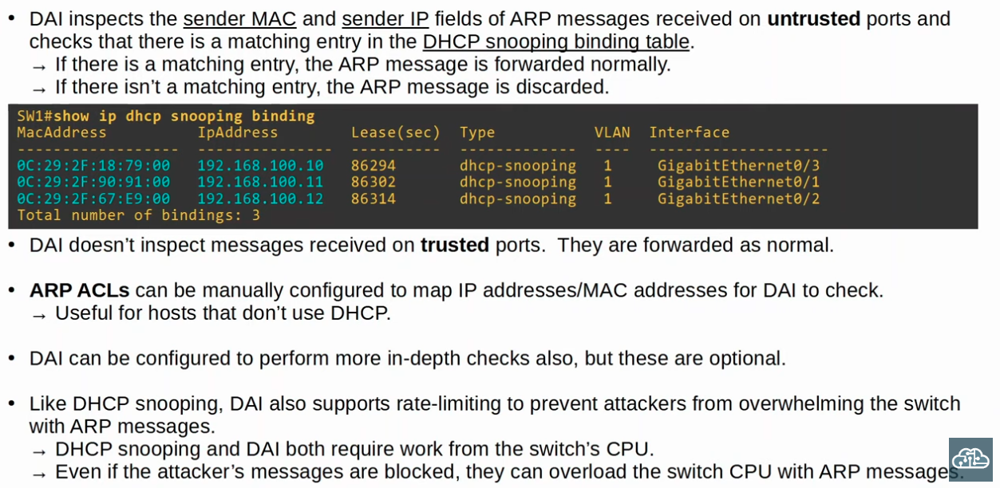
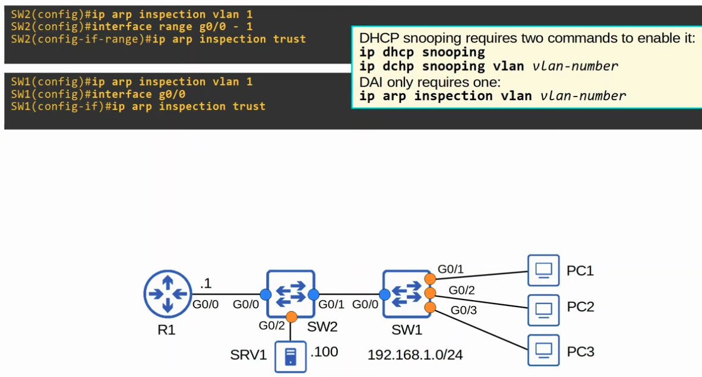
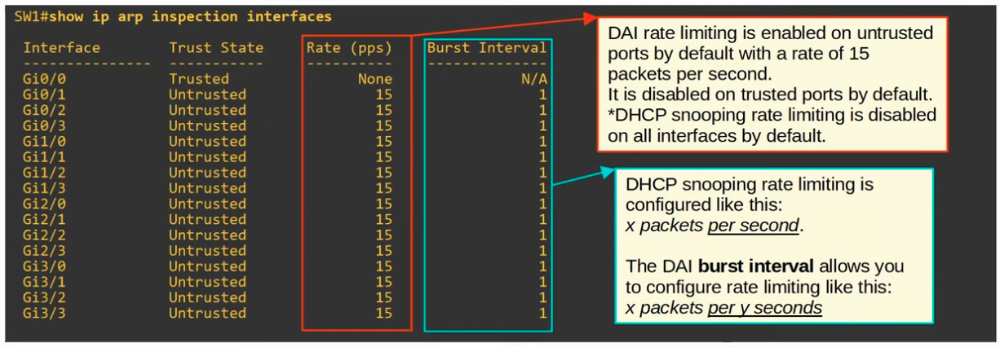
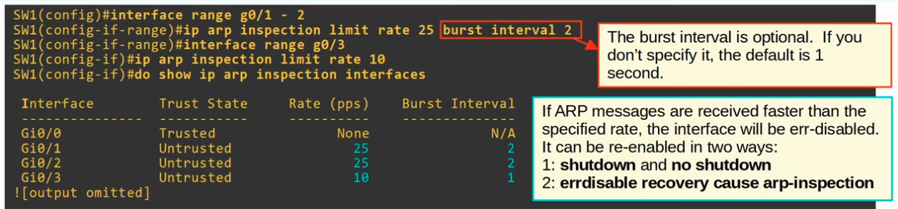
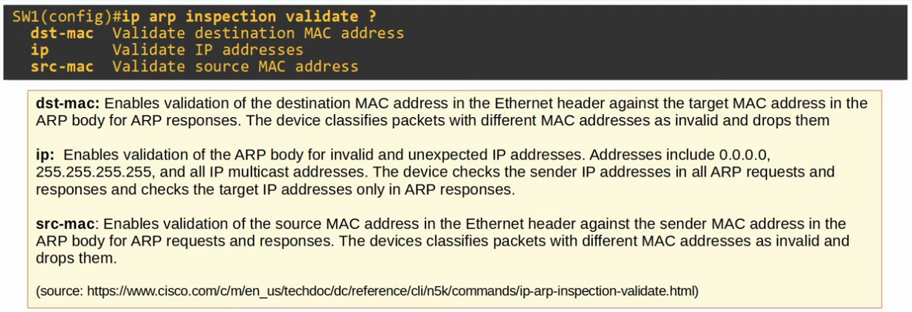
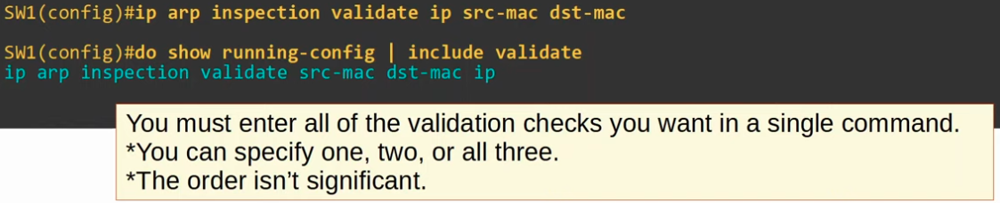
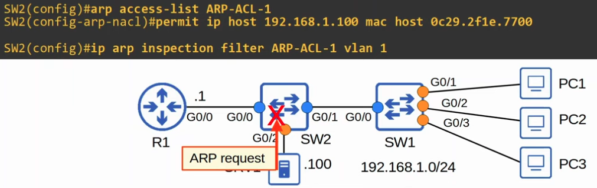
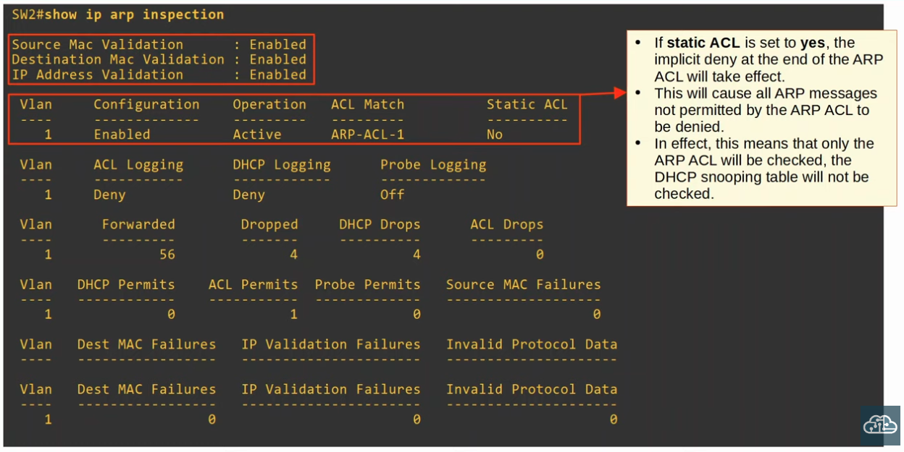
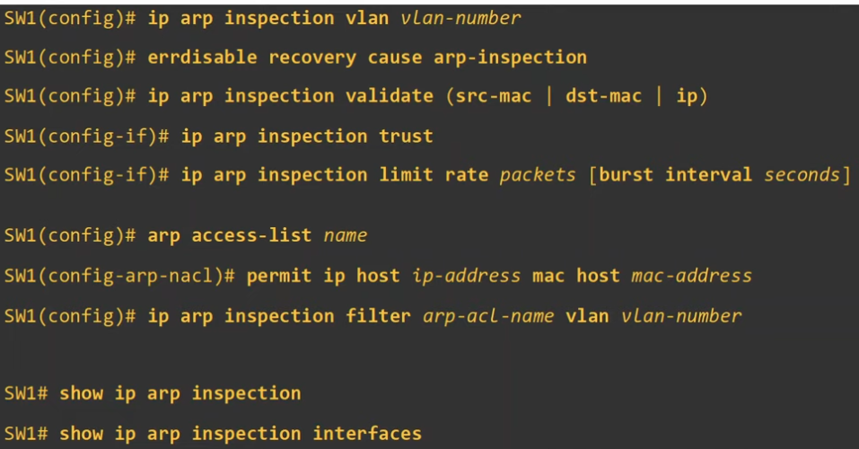

### How Dynamic ARP Inspection Operates

|  |
|-|

### Dynamic ARP Inspection Configuration

|  |
|-|

|  |
|-|

**DAI Rate Limiting**

|  |
|-|

### Dynamic ARP Inspection Additional/Optional Checks, Criteria

- These checks are done IN ADDITION to the standard DAI check (Sender MAC/IP).

|  |
|-|

- **To enable all 3 checks at once, enter all the validation checks in a single command:**

|  |
|-|

### ARP ACLs

- Configured for legitimate ARP hosts that might not have their IP address in the Switch DHCP Snooping Binding Table (Because their IP Address was statically configured)

|  |
|-|

**"Show ip ARP inspection"**

|  |
|-|

### Command Overview

|  |
|-|

