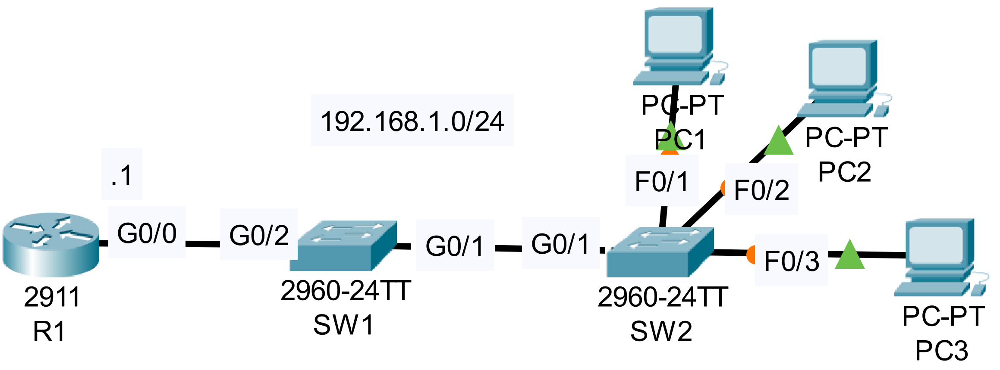

### The topology


|  |
|-|

1. Configure R1 as a DHCP server. Exclude 192.168.1.1 - 192.168.1.9 from the pool. Default gateway: R1

```CLI
R1>en
R1#conf t
R1(config)#ip dhcp excluded-address 192.168.1.1 192.168.1.9
R1(config)#ip dhcp pool POOL1

R1(dhcp-config)#network 192.168.1.0 255.255.255.0
R1(dhcp-config)#default-router 192.168.1.1
```

2. Configure DHCP snooping on SW1 and SW2.

```CLI
SW1>en
SW1#conf t
SW1(config)#ip dhcp snooping
SW1(config)#ip dhcp snooping vlan 1

SW1(config)#interface range g0/2
SW1(config-if)#ip dhcp snooping trust
```

```CLI
SW2>en
SW2#conf t
SW2(config)#ip dhcp snooping
SW2(config)#ip dhcp snooping vlan 1

SW2(config)#interface g0/1
SW2(config-if)#ip dhcp snooping trust
```

3. Configure DAI on SW1 and SW2.
  - Enable all additional validation checks
  - Trust ports connected to a router or switch

```CLI
SW1(config)#ip arp inspection vlan 1
SW1(config)#interface range g0/1 - 2

SW1(config-if-range)#ip arp inspection trust
SW1(config-if-range)#exit
SW1(config)#ip arp inspection validate dst-mac ip src-mac
```

```CLI
SW2(config)#ip arp inspection vlan 1
SW2(config)#interface g0/1

SW2(config-if)#ip arp inspection trust
SW2(config-if)#exit
SW2(config)#ip arp inspection validate dst-mac ip src-mac
```