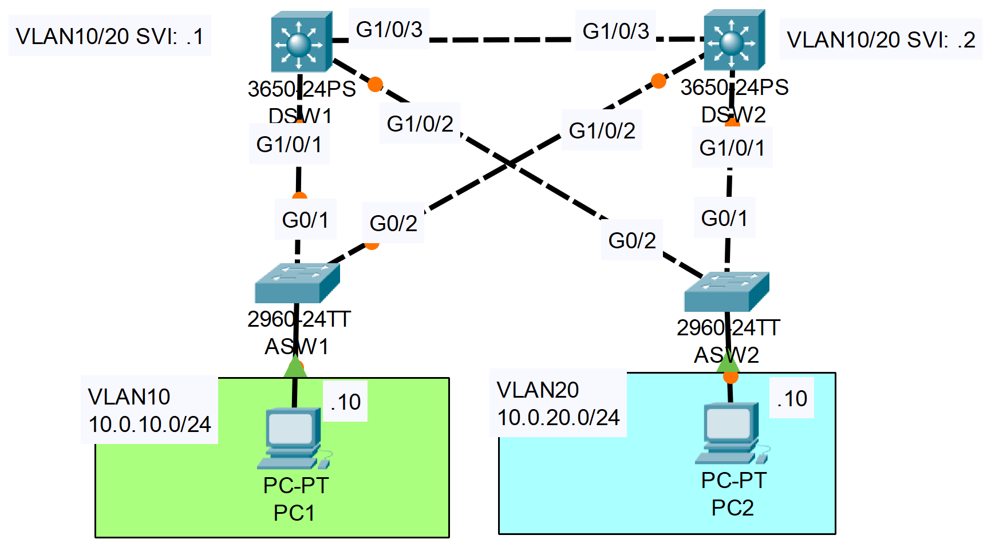

**Link to** [**Packet Tracer Solution File**](./Day%2052%20Lab%20-%20STP%20&%20HSRP%20Synchronization.pkt)

### The topology


|  |
|-|

Configure HSRP on DSW1/DSW2, and ensure sychronization with STP.
In VLAN 10:
-DSW1 is HSRP active/STP root
-DSW2 is HSRP standby/STP secondary root

**DSW1**

```CLI
DSW1>en
DSW1#conf t

DSW1(config)#spanning-tree vlan 10 root primary
DSW1(config)#spanning-tree vlan 20 root secondary

DSW1(config)#int vlan 10

DSW1(config-if)#standby version 2
DSW1(config-if)#standby 10 ip 10.0.10.254
DSW1(config-if)#standby 10 priority 105
DSW1(config-if)#standby 10 preempt
```

**DSW2**

```CLI
DSW2>en
DSW2#conf t

DSW2(config)#spanning-tree vlan 10 root secondary
DSW2(config)#spanning-tree vlan 20 root primary

DSW2(config)#interface vlan 10

DSW2(config-if)#standby version 2
DSW2(config-if)#standby 10 ip 10.0.10.254
DSW2(config-if)#standby 10 priority 95
DSW2(config-if)#standby 10 preempt
```

In VLAN 20:
-DSW2 is HSRP active/STP root
-DSW1 is HSRP standby/STP secondary root


**DSW1**

```CLI
DSW1(config-if)#interface vlan 20

DSW1(config-if)#standby version 2
DSW1(config-if)#standby 20 ip 10.0.20.254
DSW1(config-if)#standby 20 priority 95
DSW1(config-if)#standby 20 preempt

DSW1(config-if)#do show standby brief
                     P indicates configured to preempt.
                     |
Interface   Grp  Pri P State    Active          Standby         Virtual IP
Vl10        10   105 P Active   local           10.0.10.2       10.0.10.254    
Vl20        20   95  P Standby  10.0.20.2       local           10.0.20.254    
```

**DSW2**

```CLI
DSW2(config-if)#interface vlan 20

DSW2(config-if)#standby version 2
DSW2(config-if)#standby 20 ip 10.0.20.254
DSW2(config-if)#standby 20 priority 105
DSW2(config-if)#standby 20 preempt

DSW2(config-if)#do show standby brief
                     P indicates configured to preempt.
                     |
Interface   Grp  Pri P State    Active          Standby         Virtual IP
Vl10        10   95  P Standby  10.0.10.1       local           10.0.10.254    
Vl20        20   105 P Active   local           unknown         10.0.20.254    
```