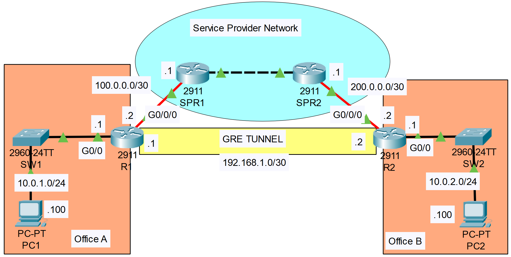

**Link to** [**Packet Tracer Solution File**](./Day%2053%20Lab%20-%20GRE%20Tunnels.pkt)

### The topology


|  |
|-|

- **Setting up GRE (GENERIC ROUTING ENCAPSULATION) Tunnel between R1 & R2**

**R1**

```CLI
R1>en
R1#conf t

R1(config)#interface Tunnel 0

R1(config-if)#tunnel source g0/0/0
R1(config-if)#tunnel destination 200.0.0.2

!CONFIGURE THE ADDRESS OF THE "TUNNEL"
R1(config-if)#ip address 192.168.1.1 255.255.255.252

!CONFIGURE THE DEFAULT ROUTE SO THAT THE ROUTERS CAN ACTUALLY COMMUNICATE FOR THE GRE TUNNEL TO WORK
R1(config-if)#exit
R1(config)#ip route 0.0.0.0 0.0.0.0 100.0.0.1
```

**R2**

```CLI
R2>en
R2#conf t

R2(config)#interface Tunnel 0
	
R2(config-if)#tunnel source g0/0/0
R2(config-if)#tunnel destination 100.0.0.2

!CONFIGURE THE ADDRESS OF THE "TUNNEL"
R2(config-if)#ip address 192.168.1.2 255.255.255.252

!CONFIGURE THE DEFAULT ROUTE SO THAT THE ROUTERS CAN ACTUALLY COMMUNICATE FOR THE GRE TUNNEL TO WORK
R2(config-if)#exit
R2(config)#ip route 0.0.0.0 0.0.0.0 200.0.0.1
```

- **Setting up OSPF so that PC's can PING each other across LANs

**R1**

```CLI
R1(config)#router OSPF 1
R1(config-router)#network 192.168.1.1 0.0.0.0 area 0
R1(config-router)#network 10.0.1.1 0.0.0.0 area 0
R1(config-router)#passive-interface g0/0
```

**R2**

```CLI
R2(config)#router OSPF 1
R2(config-router)#network 192.168.1.2 0.0.0.0 area 0
R2(config-router)#network 10.0.2.1 0.0.0.0 area 0
R2(config-router)#passive-interface g0/0
```