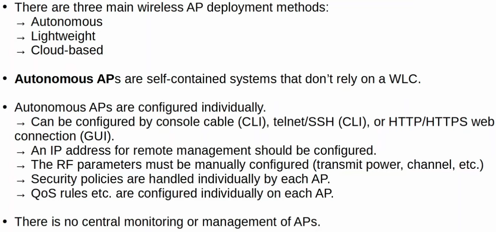
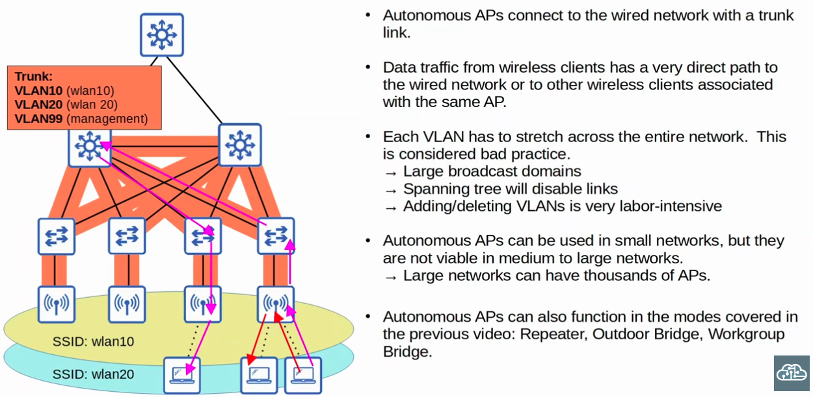
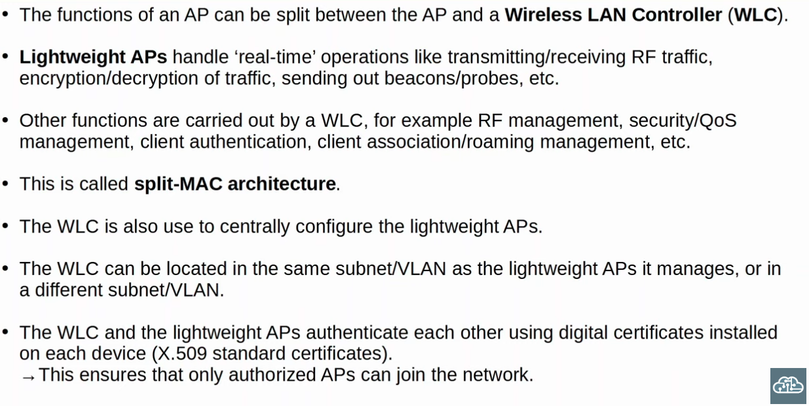
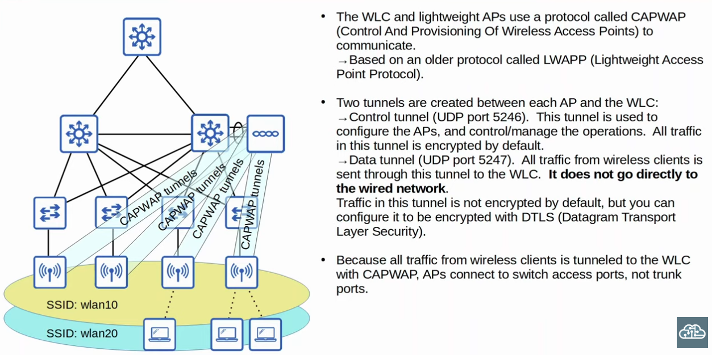
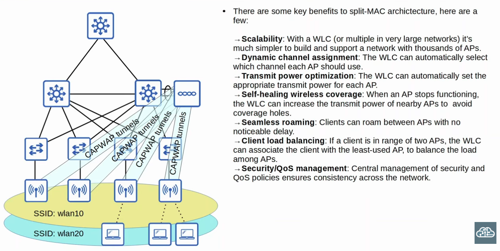
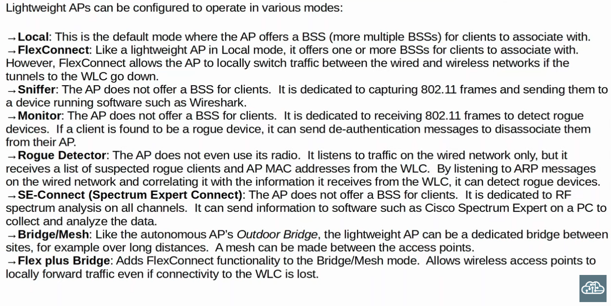
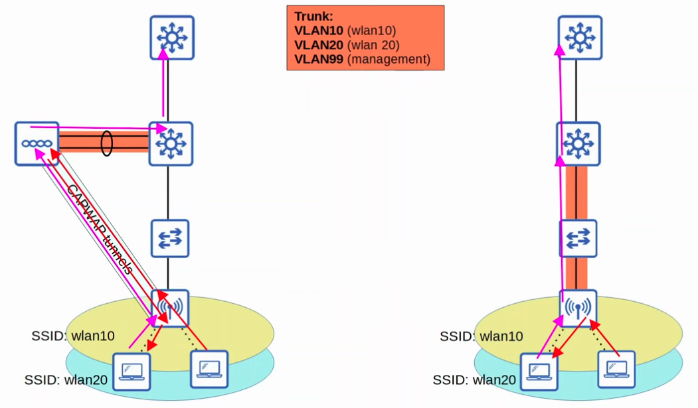

### 802.11 Frame Format

|  |
|-|

|  |
|-|

### The 802.11 Association Process

|  |
|-|

|  |
|-|

|  |
|-|

### Autonomous APs

|  |
|-|

|  |
|-|

### Lightweight APs (split-MAC architecture)

|  |
|-|

| |
|-|

|  |
|-|

|  |
|-|

- **Lightweight VS Autonomous APs**

|  |
|-|