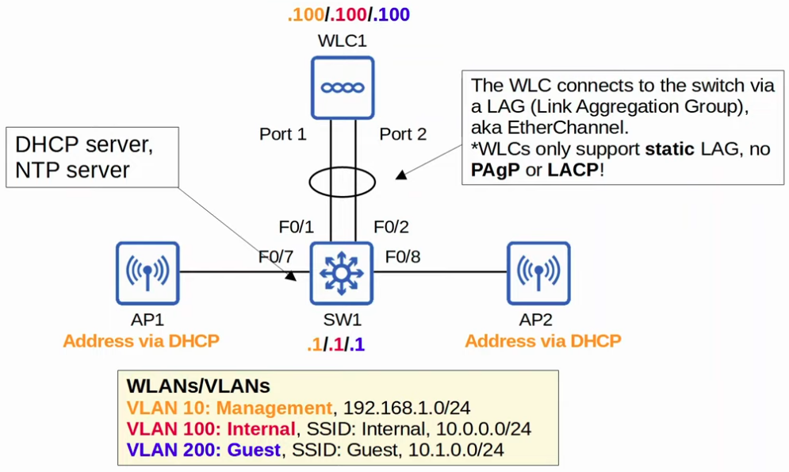
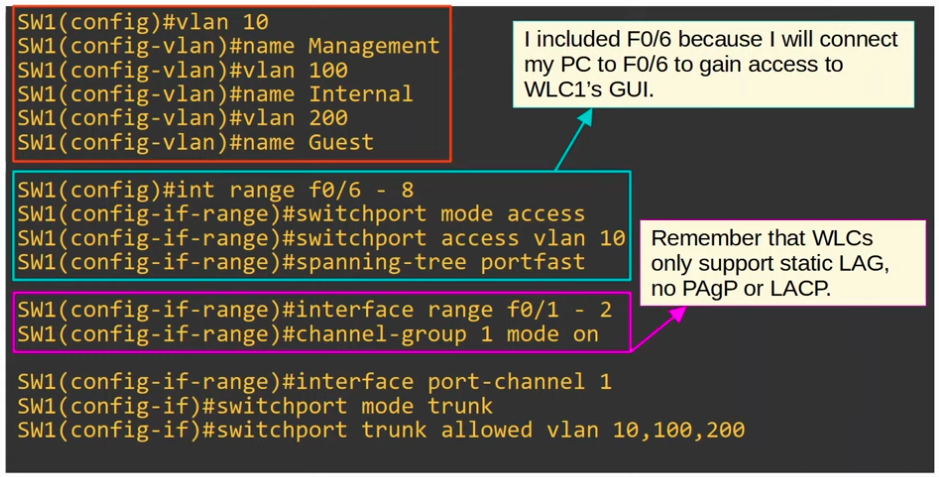
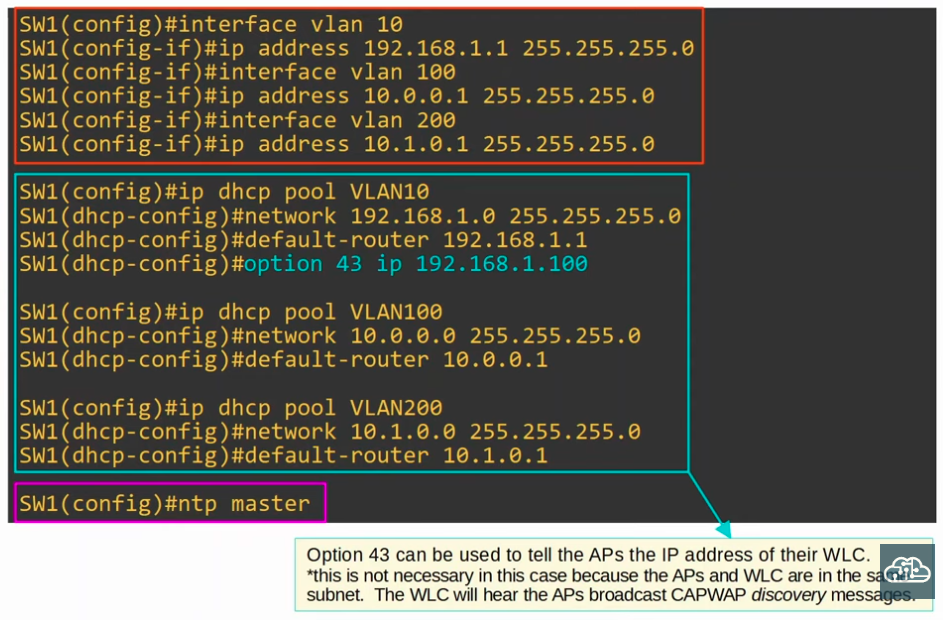
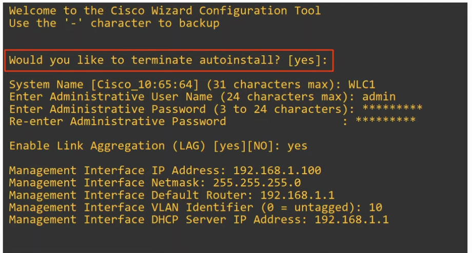
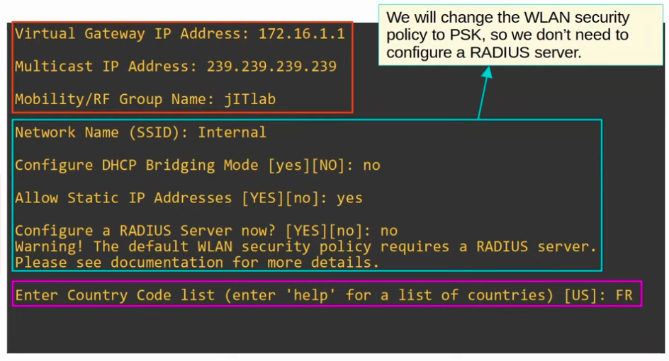
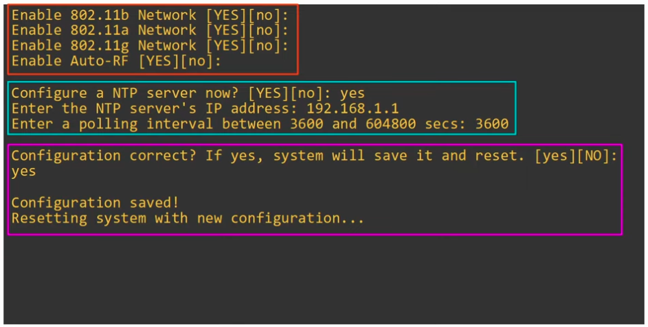
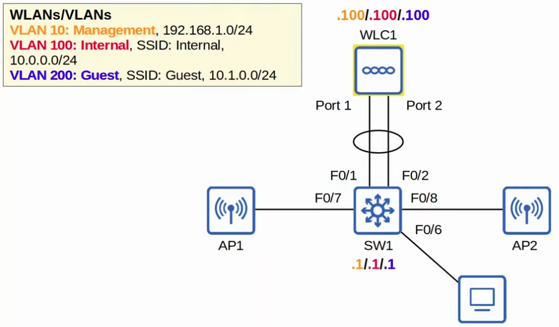
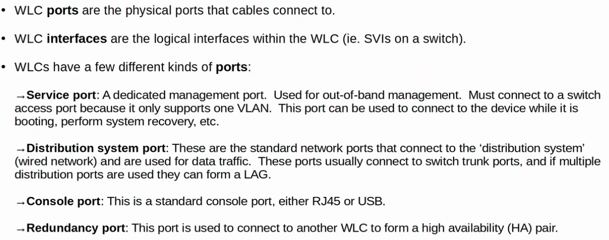
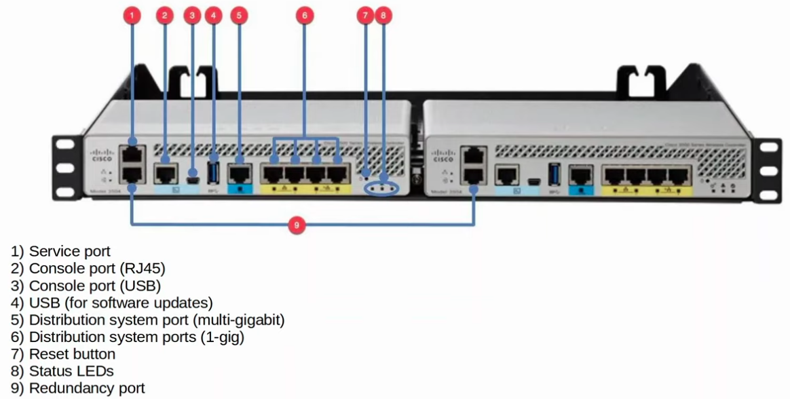
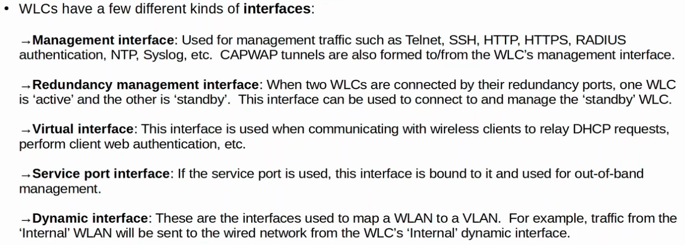

### The topology

|  |
|-|

**Switch Configuration**

|  |
|-|

|  |
|-|

**WLC Configuration**

|  |
|-|

|  |
|-|

|  |
|-|

**To Console to the WLC, connect PC to f0/6 (Management VLAN) on switch (HTTP/HTTPS Access)**

- "https://192.168.1.100"

|  |
|-|

### WLC Ports/Interfaces

|  |
|-|

|  |
|-|

|  |
|-|

