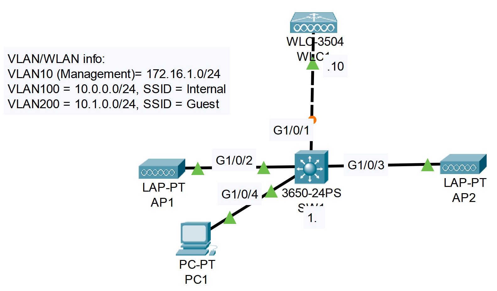

### The topology


|  |
|-|

1. Use the web browser on PC1 to access the GUI of WLC1.
Username: admin
Password: Cisco123
   *you must use HTTPS

**On PC1**

Desktop -> Web Browser -> URL: https://172.16.1.10 -> Green Login Button -> 
    User Name: admin, 
    Password: Cisco123

2. Spend some time familiarizing yourself with the WLC GUI.
    What information can be viewed from each tab?
    What is the current state of the network?

3. Configure dynamic interfaces for the Internal & Guest WLANs.

**Internal (Within the WLC GUI)**

```CLI
CONTROLLER Tab -> Interfaces -> New -> 
    Interface Name: Internal, 
    VLAN Id: 100
-> Click "Apply" -> 
    Port Number: 1, 
    VLAN Identifier: 100, 
    IP Address: 10.0.0.10, 
    Netmask: 255.255.255.0, 
    Gateway: 10.0.0.1,
    Primary DHCP Server: 10.0.0.1
-> Click "Apply"
```

**Guest (Within the WLC GUI)**

```CLI
CONTROLLER Tab -> Interfaces -> New -> 
    Interface Name: Guest, 
    VLAN Id: 200
-> Click "Apply" -> 
    Port Number: 1, 
    VLAN Identifier: 200, 
    IP Address: 10.1.0.10, 
    Netmask: 255.255.255.0, 
    Gateway: 10.1.0.1,
    Primary DHCP Server: 10.1.0.1
-> Click "Apply"
```
4. Create the Internal & Guest WLANs using WPA2+PSK.

**Internal**

```
WLANs Tab -> Dropdown "Create New -> Click "Go" ->
    Type: WLAN,
    Profile Name: Internal,
    SSID: Internal,
    ID: 1,
Click "Apply" -> General tab ->
    Status Checkbox "Enabled",
    Interface/Interface Group(G): Internal
-> Security Tab -> Layer 2 Tab ->
    Layer 2 Security: WPA+WPA2,
    WPA2 Policy: ON,
    WPA2 Encryption: AES ON,
    PSK: ON,
    PSK Format: ASCII, "Cisco123"
-> QoS Tab
```

**Guest**

```
WLANs Tab -> Dropdown "Create New -> Click "Go" ->
    Type: WLAN,
    Profile Name: Guest,
    SSID: Guest,
    ID: 2,
Click "Apply" -> General tab ->
    Status Checkbox "Enabled",
    Interface/Interface Group(G): Internal
-> Security Tab -> Layer 2 Tab ->
    Layer 2 Security: WPA+WPA2,
    WPA2 Policy: ON,
    WPA2 Encryption: AES ON,
    PSK: ON,
    PSK Format: ASCII, "Cisco123"
-> QoS Tab
```

5. Add a wireless client to the network and associate it with an AP.

**End Devices -> Smartphone -> Interface "Wireless" ->**
    **SSID: Internal,**
    **Authentication: WPA2-PSK,**
    **PSK Pass Phrase: Cisco123**
