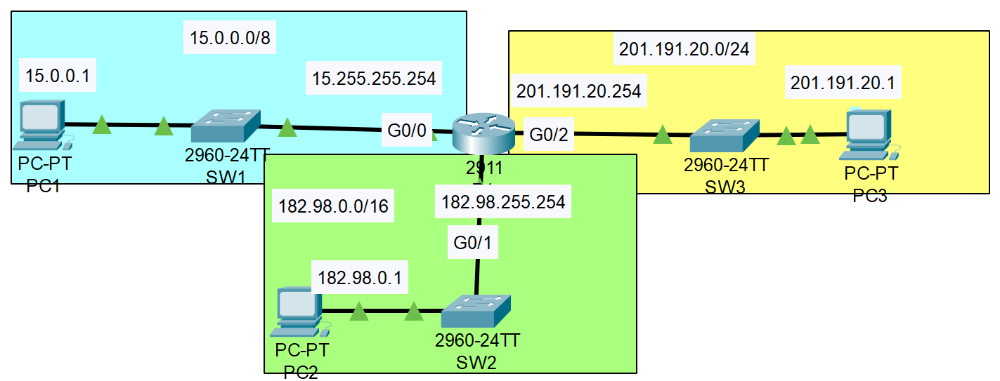

### The topology:


1. Configure R1's hostname
```CLI
Router>en
Router#conf t
Router(config)#hostname R1
R1(config)#
```

2. Use a 'show' command to view a list of R1's interfaces, their IP addresses, status, etc.
```CLI
R1(config)#do show ip int brief
```

3. Configure the appropriate IP addresses on R1's interfaces, and enable the interfaces. Configure appropriate interface descriptions
```CLI
R1(config)#interface g0/0
R1(config-if)#ip address 15.255.255.254 255.0.0.0
R1(config-if)#no shutdown
R1(config-if)#description ##to SW1##

R1(config)#interface g0/1
R1(config-if)#ip address 182.98.255.254 255.255.0.0
R1(config-if)#no shutdown
R1(config-if)#description ##to SW2##

R1(config)#interface g0/2
R1(config-if)#ip address 201.191.20.254 255.255.255.0
R1(config-if)#no shutdown
R1(config-if)#description ##to SW3##
```

4. Use a 'show' command to verify R1's interfaces again.
```CLI
R1#show ip int brief
```

5. View the running config to confirm the configuration changes, then save the config
```CLI
R1#show running-config
R1#copy running-config startup-config
```

7. Ping from PC1 to PC2 and PC3 to test connectivity
```CLI
C:\>ping 182.98.255.254

Pinging 182.98.255.254 with 32 bytes of data:

Reply from 182.98.255.254: bytes=32 time=51ms TTL=255
Reply from 182.98.255.254: bytes=32 time=16ms TTL=255
Reply from 182.98.255.254: bytes=32 time<1ms TTL=255
Reply from 182.98.255.254: bytes=32 time=3ms TTL=255

Ping statistics for 182.98.255.254:
    Packets: Sent = 4, Received = 4, Lost = 0 (0% loss),
Approximate round trip times in milli-seconds:
    Minimum = 0ms, Maximum = 51ms, Average = 17ms

C:\>ping 201.191.20.254

Pinging 201.191.20.254 with 32 bytes of data:

Reply from 201.191.20.254: bytes=32 time=1ms TTL=255
Reply from 201.191.20.254: bytes=32 time<1ms TTL=255
Reply from 201.191.20.254: bytes=32 time<1ms TTL=255
Reply from 201.191.20.254: bytes=32 time=10ms TTL=255

Ping statistics for 201.191.20.254:
    Packets: Sent = 4, Received = 4, Lost = 0 (0% loss),
Approximate round trip times in milli-seconds:
    Minimum = 0ms, Maximum = 10ms, Average = 2ms
```