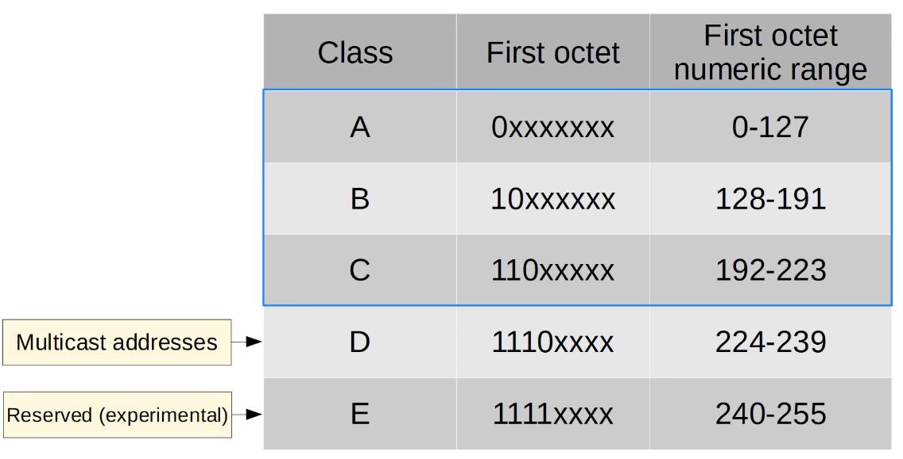
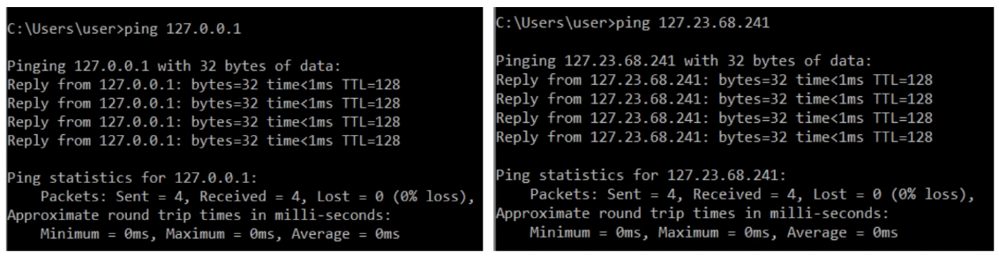

### IPV4 Address format:

### IPV4 Address classes:

Note: Class A addresses use a /8 prefix, Class B addresses use a /16 prefix, and class C addresses use a /24 prefix

### *Important Note: The end of the Class A range of address is usually considered to be 126, because the 127 range of addresses is reserved for LOOPBACK ADDRESSES

### LOOPBACK ADDRESSES (range 127.0.0.0 to 127.255.255.255) are self-testing mechanisms for a host device to test its own network stack.
If a device sends any network traffic to an address in this range, it is simply processed back up the TCP/IP stack of the device itself, as if it were received from another device.

Notice the 0ms round trip times:
