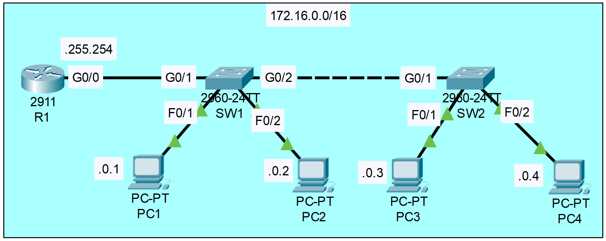

### The topology:


|  |
|-|

1. Configure the hostname of R1, SW1, and SW2
```CLI
Router>en
Router#conf t
Router(config)#hostname R1

Switch>en
Switch#conf t
Switch(config)#hostname SW1

Switch>en
Switch#conf t
Switch(config)#hostname SW2
```

2. Configure the appropriate IP addresses on R1, PC1, PC2, PC3, PC4
```CLI
R1(config)#interface g0/0
R1(config-if)#ip address 17.16.255.254 255.255.0.0
R1(config-if)#no shutdown
R1(config-if)#description ## to SW1 ##
```

3. Manually configure the speed and duplex on interfaces connected to other networking devices (not end hosts)
```CLI
R1(config)#interface g0/0
R1(config-if)#speed ?
  10    Force 10 Mbps operation
  100   Force 100 Mbps operation
  1000  Force 1000 Mbps operation
  auto  Enable AUTO speed configuration
R1(config-if)#speed 1000
R1(config-if)#duplex ?
  auto  Enable AUTO duplex configuration
  full  Force full duplex operation
  half  Force half-duplex operation
R1(config-if)#duplex full

SW1(config)#interface g0/1
SW1(config-if)#speed ?
  10    Force 10 Mbps operation
  100   Force 100 Mbps operation
  1000  Force 1000 Mbps operation
  auto  Enable AUTO speed configuration
SW1(config-if)#speed 1000
SW1(config-if)#duplex ?
  auto  Enable AUTO duplex configuration
  full  Force full duplex operation
  half  Force half-duplex operation
SW1(config-if)#duplex full

SW1(config)#interface g0/2
SW1(config-if)#speed ?
  10    Force 10 Mbps operation
  100   Force 100 Mbps operation
  1000  Force 1000 Mbps operation
  auto  Enable AUTO speed configuration
SW1(config-if)#speed 1000
SW1(config-if)#duplex ?
  auto  Enable AUTO duplex configuration
  full  Force full duplex operation
  half  Force half-duplex operation
SW1(config-if)#duplex full

SW2(config)#interface g0/1
SW2(config-if)#speed ?
  10    Force 10 Mbps operation
  100   Force 100 Mbps operation
  1000  Force 1000 Mbps operation
  auto  Enable AUTO speed configuration
SW2(config-if)#speed 1000
SW2(config-if)#duplex ?
  auto  Enable AUTO duplex configuration
  full  Force full duplex operation
  half  Force half-duplex operation
SW2(config-if)#duplex full
```

4. Configure appropriate descriptions on each interface
```CLI
R1#
R1#conf t
R1(config)#interface g0/0
R1(config-if)#desc ## to SW1 ##

SW1#
SW1#conf t
SW1(config)#interface g0/1
SW1(config-if)#desc ## to R1 ##

SW1(config)#interface g0/2
SW1(config-if)#desc ## to SW2 ##

SW1(config)#interface f0/1 - 2
SW1(config-if-range)#desc ## to end host ##

SW2#
SW2#conf t
SW2(config)#interface g0/1
SW2(config-if)#desc ## to SW1 ##

SW2(config)#interface f0/1 - 2
SW2(config-if-range)#desc ## to end host ##
```

5. Disable interfaces which are not connected to other devices
```CLI
R1#conf t
R1(config)#interface range g0/1 - 2
R1(config-if-range)#desc ## not in use ##
R1(config-if-range)#shutdown

SW1(config)#interface g0/1
SW1(config-if-range)#interface range f0/3 - 24
SW1(config-if-range)#desc ## not in use ##
SW1(config-if-range)#shutdown

SW2(config)#interface g0/1
SW2(config-if-range)#interface range f0/3 - 24
SW2(config-if-range)#desc ## not in use ##
SW2(config-if-range)#shutdown
```