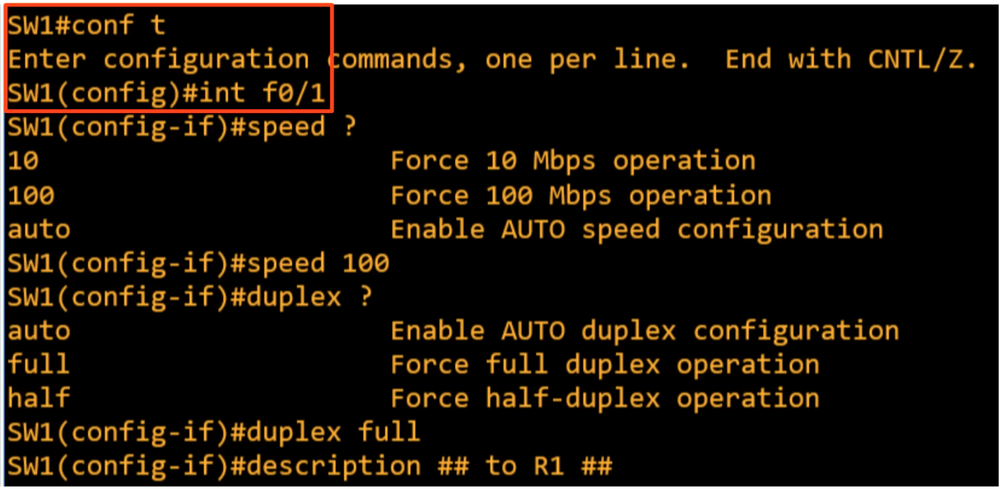
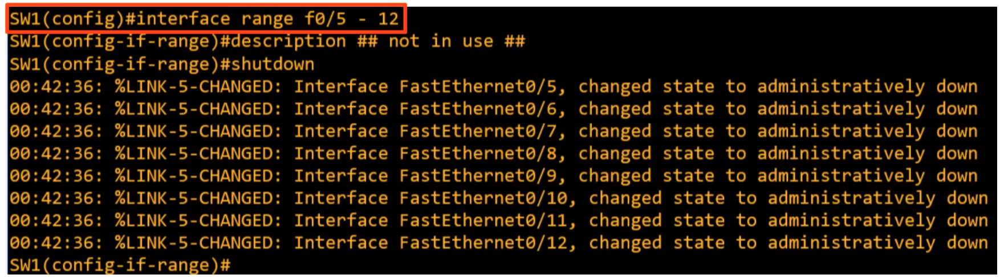

### Switch commands to configure speed and duplex-ity on interfaces

### The fact that switch interfaces are automatically activated once connected to a host device may pose a security risk, therefore we have to issue a shutdown command to each of the interfaces, preferrably using the 'interface range' mode:

