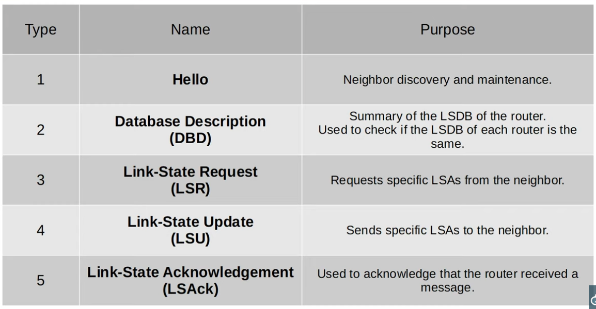

### Reference Bandwidth configuration (default is 100 for OSPF):

```CLI
Router(config-router)#auto-cost refernce-bandwidth <rb_in_mpbs>
```

### Configuring the OSPF cost of an interface:

```CLI
Router(config-if)#ip ospf cost <custom_cost>
```

- This new cost will take priority over the auto-calculated cost.

### Configuring the interface bandwidth:

```CLI
Router(config-if)#bandwidth <bw_in_kbps>
```

- This does not change the actual speed of the interface - it's just another way of modifying the resultant OSPF cost of the interface

### The 5 different OSPF Message types:



### Extra OSPF Configurations:

```CLI
Router(config-if)#ip ospf <process_id> area <area_id>

                    ####
                    
R1(config-if)#interface g0/0
R1(config-if)#ip ospf 1 area 0
```